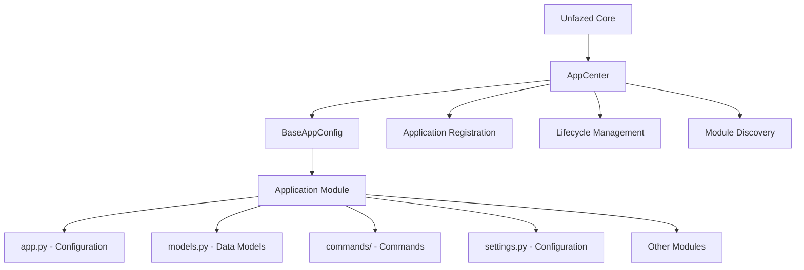
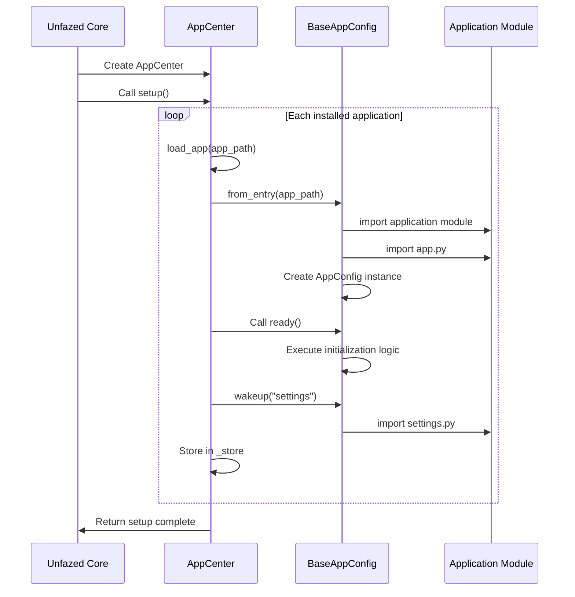

Unfazed APP Application System
==================

The Unfazed APP system is the core organizational mechanism of the framework, providing complete application lifecycle management, modular organization, and dependency injection capabilities. Through `BaseAppConfig` and `AppCenter`, developers can create highly modular, reusable, and maintainable applications.

## System Overview

### Core Features

- **Application Lifecycle Management**: Automated application loading, initialization, and configuration
- **Modular Organization**: Application structure based on Python modules
- **Command Discovery**: Automatic discovery and registration of commands within applications
- **Lazy Loading**: Support for on-demand module loading (wakeup mechanism)
- **Configuration Management**: Application-level configuration and settings management
- **Registry Center**: Unified application registration and access mechanism

### System Architecture



### Core Components

- **BaseAppConfig**: Application configuration base class, defines basic application behavior
- **AppCenter**: Application registry center, manages all installed applications
- **Application Module**: Python modules containing business logic
- **Lifecycle Hooks**: `ready()` method for application initialization

## Quick Start

### Creating Applications

Use Unfazed CLI to create new applications:

```bash
# Create standard application
unfazed-cli startapp -n myapp

# Create complex application (includes more files)
unfazed-cli startapp -n myapp --template complex
```

### Application Directory Structure

Standard application structure:

```
myapp/
├── app.py              # Application configuration entry [Required]
├── models.py           # Data model definitions
├── endpoints.py        # API endpoint definitions
├── routes.py           # Route configuration
├── serializers.py      # Data serializers
├── services.py         # Business logic services
├── schema.py           # Data model definitions
├── settings.py         # Application-level configuration [Optional]
├── admin.py            # Admin management configuration [Optional]
├── commands/           # Custom commands directory [Optional]
│   ├── __init__.py
│   ├── import_data.py  # Custom command files
│   └── export_data.py
└── tests/              # Test directory [Optional]
    ├── __init__.py
    ├── test_models.py
    ├── test_endpoints.py
    └── test_services.py
```

### Basic Application Configuration

```python
# myapp/app.py
from unfazed.app import BaseAppConfig

class AppConfig(BaseAppConfig):
    """Application configuration class"""
    
    async def ready(self) -> None:
        """Initialization method called when application is ready"""
        print(f"Application {self.name} is ready")
        
        # Execute application initialization logic
        await self.init_default_data()
        
        # Register signal handlers
        await self.setup_signal_handlers()
    
    async def init_default_data(self):
        """Initialize default data"""
        # Application startup data initialization logic
        pass
    
    async def setup_signal_handlers(self):
        """Set up signal handlers"""
        # Register application-level signal handlers
        pass
```

### Registering Applications

Register applications in project configuration:

```python
# settings.py
UNFAZED_SETTINGS = {
    "INSTALLED_APPS": [
        "unfazed.contrib.auth",     # Unfazed built-in application
        "unfazed.contrib.admin",    # Admin application
        "myapp",                    # Custom application
        "blog",                     # Blog application
        "user_management",          # User management application
    ],
    # Other configurations...
}
```


## Application Lifecycle

### Application Loading Process



Through the Unfazed APP system, developers can build highly modular, maintainable, and scalable Web applications, effectively managing the organizational structure and dependencies of complex projects.
