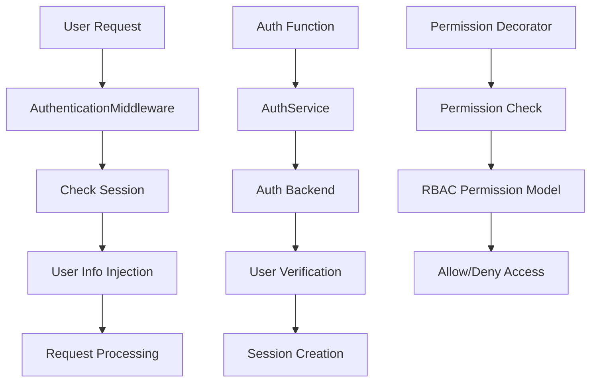

Unfazed Auth Authentication System
=================================

Unfazed Auth is a comprehensive user authentication and permission management system that provides core functionalities including user management, role-based access control, multi-platform login, and session management for Unfazed applications. It adopts a flexible backend architecture design, supporting various authentication methods including traditional username-password authentication and OAuth authentication.

## System Overview

### Core Features

- **User Management**: Complete user registration, login, and logout functionality
- **Permission System**: RBAC permission model based on Roles and Permissions
- **User Group Management**: Support user grouping to simplify permission assignment
- **Multi-Backend Support**: Extensible authentication backend architecture supporting various authentication methods
- **Session Management**: Integrated Session system with automatic user state handling
- **Decorator Support**: Provides `@login_required` and `@permission_required` decorators
- **Middleware Integration**: Automatically inject user information into request objects
- **OAuth Support**: Support third-party OAuth login

### System Architecture



### Core Components

- **AbstractUser**: Abstract user model supporting custom user models
- **Role**: Role model defining user roles
- **Permission**: Permission model defining specific permissions
- **Group**: User group model supporting batch permission management
- **AuthService**: Authentication service providing unified authentication logic management
- **BaseAuthBackend**: Authentication backend base class supporting multiple authentication methods
- **AuthenticationMiddleware**: Authentication middleware automatically handling user state

## Quick Start

### Basic Configuration

```python
# settings.py
UNFAZED_SETTINGS = {
    "INSTALLED_APPS": [
        "unfazed.contrib.session",  # Auth depends on Session
        "unfazed.contrib.auth",     # Enable Auth system
        "myapp.users",
    ],
    "MIDDLEWARE": [
        "unfazed.contrib.session.middleware.SessionMiddleware",
        "unfazed.contrib.auth.middleware.AuthenticationMiddleware",
        # Other middleware...
    ],
    # Auth system configuration
    "UNFAZED_CONTRIB_AUTH_SETTINGS": {
        "USER_MODEL": "myapp.users.models.User",
        "SESSION_KEY": "unfazed_auth_session",
        "BACKENDS": {
            "default": {
                "BACKEND_CLS": "unfazed.contrib.auth.backends.default.DefaultAuthBackend",
                "OPTIONS": {}
            }
        }
    }
}
```

### Creating User Model

```python
# myapp/users/models.py
from tortoise import fields
from unfazed.contrib.auth.models import AbstractUser

class User(AbstractUser):
    """Custom user model"""
    
    # Inherits AbstractUser fields:
    # - account: user account
    # - password: password
    # - email: email
    # - is_superuser: whether superuser
    # - groups: user group relationships
    # - roles: role relationships
    
    # Add custom fields
    first_name = fields.CharField(max_length=50, default="")
    last_name = fields.CharField(max_length=50, default="")
    phone = fields.CharField(max_length=20, default="")
    avatar = fields.CharField(max_length=255, default="")
    is_active = fields.BooleanField(default=True)
    date_joined = fields.DatetimeField(auto_now_add=True)
    last_login = fields.DatetimeField(null=True)
    
    class Meta:
        table = "users"
        
    def __str__(self):
        return self.account
    
    @property
    def full_name(self):
        """Get full name"""
        return f"{self.first_name} {self.last_name}".strip()
    
    @property
    def is_staff(self):
        """Whether staff member (for Admin system)"""
        return self.is_superuser
```

### Configure Routes

```python
# urls.py
from unfazed.route import path, include

urlpatterns = [
    # Auth API routes
    path("/api/contrib/auth/", include("unfazed.contrib.auth.routes")),
    # Application routes
    path("/api/myapp", include("myapp.routes")),
]
```

## User Authentication Features

### User Registration

```python
# Frontend call example
POST /api/contrib/auth/register
Content-Type: application/json

{
    "account": "alice",
    "password": "secret123",
    "platform": "default",
    "extra": {
        "email": "alice@example.com",
        "first_name": "Alice",
        "last_name": "Smith"
    }
}

# Response
{
    "success": true,
    "data": {},
    "message": "Registration successful"
}
```

### User Login

```python
# Frontend call example
POST /api/contrib/auth/login
Content-Type: application/json

{
    "account": "alice",
    "password": "secret123",
    "platform": "default",
    "extra": {}
}

# Response
{
    "success": true,
    "data": {
        "account": "alice",
        "email": "alice@example.com",
        "roles": [
            {"id": 1, "name": "User"},
            {"id": 2, "name": "Editor"}
        ],
        "groups": [
            {"id": 1, "name": "Content Team"}
        ],
        "extra": {
            "first_name": "Alice",
            "last_name": "Smith"
        }
    },
    "message": "Login successful"
}
```

### User Logout

```python
# Frontend call example
POST /api/contrib/auth/logout
Content-Type: application/json

{}

# Response
{
    "success": true,
    "data": {},
    "message": "Logout successful"
}
```

### Using User Information in Views

```python
# myapp/endpoints.py
from unfazed.http import HttpRequest, JsonResponse
from unfazed.contrib.auth.decorators import login_required

@login_required
async def user_profile(request: HttpRequest) -> JsonResponse:
    """Get user information - requires login"""
    user = request.user
    
    return JsonResponse({
        "account": user.account,
        "email": user.email,
        "full_name": user.full_name,
        "is_superuser": user.is_superuser,
        "date_joined": user.date_joined.isoformat()
    })

async def public_info(request: HttpRequest) -> JsonResponse:
    """Public information - no login required"""
    if request.user:
        message = f"Welcome back, {request.user.account}!"
    else:
        message = "Welcome to our website"
    
    return JsonResponse({"message": message})
```

## Permission Management System

### RBAC Permission Model

Unfazed Auth adopts Role-Based Access Control (RBAC) model:

```
User ←→ Role ←→ Permission
  ↓      ↓
Group ←→ Role
```

### Creating Permissions and Roles

```python
# Permission management example
from unfazed.contrib.auth.models import Role, Permission, Group

async def setup_permissions():
    """Setup permission system"""
    
    # Create permissions
    permissions = [
        ("article.view", "View articles"),
        ("article.create", "Create articles"),
        ("article.edit", "Edit articles"),
        ("article.delete", "Delete articles"),
        ("user.view", "View users"),
        ("user.manage", "Manage users"),
        ("system.admin", "System administration"),
    ]
    
    for access, remark in permissions:
        await Permission.create(access=access, remark=remark)
    
    # Create roles
    # 1. Reader role
    reader_role = await Role.create(name="Reader")
    await reader_role.permissions.add(
        await Permission.get(access="article.view")
    )
    
    # 2. Editor role
    editor_role = await Role.create(name="Editor")
    editor_permissions = await Permission.filter(
        access__in=["article.view", "article.create", "article.edit"]
    )
    await editor_role.permissions.add(*editor_permissions)
    
    # 3. Administrator role
    admin_role = await Role.create(name="Administrator")
    all_permissions = await Permission.all()
    await admin_role.permissions.add(*all_permissions)
    
    # Create user groups
    content_group = await Group.create(name="Content Team")
    await content_group.roles.add(editor_role)
    
    admin_group = await Group.create(name="Admin Team")
    await admin_group.roles.add(admin_role)
    
    return {
        "roles": [reader_role, editor_role, admin_role],
        "groups": [content_group, admin_group]
    }

async def assign_user_permissions():
    """Assign user permissions"""
    # Assign permissions through roles
    user = await User.get(account="alice")
    editor_role = await Role.get(name="Editor")
    await user.roles.add(editor_role)
    
    # Assign permissions through user groups
    content_group = await Group.get(name="Content Team")
    await user.groups.add(content_group)
```

### Permission Checking

```python
# Use decorators for permission checking
from unfazed.contrib.auth.decorators import permission_required

@permission_required("article.create")
async def create_article(request: HttpRequest) -> JsonResponse:
    """Create article - requires article.create permission"""
    user = request.user
    
    # Business logic
    article_data = await request.json()
    # ... create article
    
    return JsonResponse({"message": "Article created successfully"})

@permission_required("user.manage")
async def manage_users(request: HttpRequest) -> JsonResponse:
    """User management - requires user.manage permission"""
    # User management business logic
    return JsonResponse({"message": "User management page"})

# Manual permission checking
async def check_user_permissions(request: HttpRequest) -> JsonResponse:
    """Manual permission checking"""
    user = request.user
    
    if not user:
        return JsonResponse({"error": "Not logged in"}, status_code=401)
    
    # Check single permission
    can_edit = await user.has_permission("article.edit")
    
    # Check multiple permissions
    permissions = {
        "can_view": await user.has_permission("article.view"),
        "can_create": await user.has_permission("article.create"),
        "can_edit": await user.has_permission("article.edit"),
        "can_delete": await user.has_permission("article.delete"),
    }
    
    return JsonResponse({
        "user": user.account,
        "permissions": permissions
    })
```

### Query User Permission Information

```python
async def get_user_auth_info(user_id: int):
    """Get user's complete permission information"""
    user = await User.get(id=user_id)
    
    # Get user roles
    user_roles = await user.query_roles()
    
    # Get user groups
    user_groups = await user.query_groups()
    
    # Get all permissions
    all_permissions = set()
    for role in user_roles:
        role_permissions = await role.query_permissions()
        all_permissions.update(perm.access for perm in role_permissions)
    
    return {
        "user": {
            "id": user.id,
            "account": user.account,
            "email": user.email,
            "is_superuser": user.is_superuser
        },
        "roles": [{"id": role.id, "name": role.name} for role in user_roles],
        "groups": [{"id": group.id, "name": group.name} for group in user_groups],
        "permissions": list(all_permissions)
    }
```

## Custom Authentication Backends

### Creating Custom Authentication Backend

```python
# myapp/auth_backends.py
from unfazed.contrib.auth.backends.base import BaseAuthBackend
from unfazed.contrib.auth.schema import LoginCtx, RegisterCtx
from unfazed.contrib.auth.models import AbstractUser
from unfazed.exception import AccountNotFound, WrongPassword
import bcrypt
import jwt
from datetime import datetime, timedelta

class JWTAuthBackend(BaseAuthBackend):
    """JWT authentication backend"""
    
    @property
    def alias(self) -> str:
        return "jwt"
    
    async def login(self, ctx: LoginCtx):
        """JWT login"""
        UserCls = AbstractUser.UserCls()
        
        # Find user
        user = await UserCls.get_or_none(account=ctx.account)
        if not user:
            raise AccountNotFound(f"Account {ctx.account} does not exist")
        
        # Verify password (using bcrypt)
        if not bcrypt.checkpw(ctx.password.encode(), user.password.encode()):
            raise WrongPassword("Incorrect password")
        
        # Generate session information
        session_info = await self.session_info(user, ctx)
        
        # Generate JWT Token
        token = self.generate_jwt_token(user)
        
        resp = {
            "account": user.account,
            "email": user.email,
            "token": token,
            "expires_in": 3600,  # 1 hour
            "roles": [{"id": role.id, "name": role.name} for role in await user.query_roles()],
            "groups": [{"id": group.id, "name": group.name} for group in await user.query_groups()]
        }
        
        return session_info, resp
    
    async def register(self, ctx: RegisterCtx):
        """JWT registration"""
        UserCls = AbstractUser.UserCls()
        
        # Check if account already exists
        existing_user = await UserCls.get_or_none(account=ctx.account)
        if existing_user:
            raise ValueError(f"Account {ctx.account} already exists")
        
        # Encrypt password
        hashed_password = bcrypt.hashpw(ctx.password.encode(), bcrypt.gensalt()).decode()
        
        # Create user
        user = await UserCls.create(
            account=ctx.account,
            password=hashed_password,
            email=ctx.extra.get("email", ""),
            first_name=ctx.extra.get("first_name", ""),
            last_name=ctx.extra.get("last_name", "")
        )
        
        return {"user_id": user.id, "account": user.account}
    
    async def session_info(self, user: AbstractUser, ctx: LoginCtx):
        """Build session information"""
        return {
            "id": user.id,
            "account": user.account,
            "email": user.email,
            "platform": ctx.platform,
            "login_time": datetime.now().isoformat()
        }
    
    async def logout(self, session):
        """JWT logout (can implement blacklist mechanism)"""
        # JWT is usually stateless, can implement logout through blacklist
        return {"message": "Logout successful"}
    
    def generate_jwt_token(self, user: AbstractUser) -> str:
        """Generate JWT Token"""
        payload = {
            "user_id": user.id,
            "account": user.account,
            "exp": datetime.utcnow() + timedelta(hours=1),
            "iat": datetime.utcnow()
        }
        
        secret_key = self.options.get("SECRET_KEY", "your-secret-key")
        return jwt.encode(payload, secret_key, algorithm="HS256")
    
    async def oauth_login_redirect(self) -> str:
        """OAuth login redirect (not implemented)"""
        return ""
    
    async def oauth_logout_redirect(self) -> str:
        """OAuth logout redirect (not implemented)"""
        return ""

class LDAPAuthBackend(BaseAuthBackend):
    """LDAP authentication backend example"""
    
    @property
    def alias(self) -> str:
        return "ldap"
    
    async def login(self, ctx: LoginCtx):
        """LDAP login"""
        # LDAP authentication logic
        ldap_server = self.options.get("LDAP_SERVER")
        
        # 1. Connect to LDAP server
        # 2. Verify user credentials
        # 3. Get user information
        # 4. Create or update user locally
        
        # Example implementation (requires python-ldap)
        UserCls = AbstractUser.UserCls()
        
        # Assume LDAP authentication successful
        ldap_user_info = await self.authenticate_ldap(ctx.account, ctx.password)
        
        # Create or update user locally
        user, created = await UserCls.get_or_create(
            account=ctx.account,
            defaults={
                "email": ldap_user_info.get("email", ""),
                "first_name": ldap_user_info.get("given_name", ""),
                "last_name": ldap_user_info.get("surname", "")
            }
        )
        
        if not created:
            # Update user information
            user.email = ldap_user_info.get("email", user.email)
            await user.save()
        
        session_info = await self.session_info(user, ctx)
        resp = {
            "account": user.account,
            "email": user.email,
            "source": "ldap"
        }
        
        return session_info, resp
    
    async def authenticate_ldap(self, username: str, password: str):
        """LDAP authentication implementation"""
        # Actual LDAP authentication logic
        # This is just an example
        return {
            "email": f"{username}@company.com",
            "given_name": username.title(),
            "surname": "User"
        }
    
    # ... implementations of other required methods
```

### Configure Custom Backend

```python
# settings.py
UNFAZED_SETTINGS = {
    "UNFAZED_CONTRIB_AUTH_SETTINGS": {
        "USER_MODEL": "myapp.users.models.User",
        "BACKENDS": {
            "default": {
                "BACKEND_CLS": "unfazed.contrib.auth.backends.default.DefaultAuthBackend",
                "OPTIONS": {}
            },
            "jwt": {
                "BACKEND_CLS": "myapp.auth_backends.JWTAuthBackend",
                "OPTIONS": {
                    "SECRET_KEY": "your-jwt-secret-key"
                }
            },
            "ldap": {
                "BACKEND_CLS": "myapp.auth_backends.LDAPAuthBackend",
                "OPTIONS": {
                    "LDAP_SERVER": "ldap://your-ldap-server.com",
                    "BASE_DN": "dc=company,dc=com"
                }
            }
        }
    }
}

# Login using different backends
# JWT login
POST /api/contrib/auth/login
{
    "account": "alice",
    "password": "secret123",
    "platform": "jwt"
}

# LDAP login
POST /api/contrib/auth/login
{
    "account": "alice",
    "password": "secret123",
    "platform": "ldap"
}
```

## Middleware and Decorators

### AuthenticationMiddleware

```python
# Middleware automatically injects user information
class AuthenticationMiddleware:
    """
    Authentication middleware automatically:
    1. Read user information from Session
    2. Inject user object into request.user
    3. If not logged in, request.user is None
    """
    
    async def __call__(self, scope, receive, send):
        # Get user information from session
        session = scope.get("session")
        if session and "unfazed_auth_session" in session:
            user_data = session["unfazed_auth_session"]
            UserCls = AbstractUser.UserCls()
            user = await UserCls.from_session(user_data)
            scope["user"] = user
        else:
            scope["user"] = None
        
        await self.app(scope, receive, send)
```

### Decorator Usage

```python
from unfazed.contrib.auth.decorators import login_required, permission_required

# 1. Login check decorator
@login_required
async def user_dashboard(request: HttpRequest) -> JsonResponse:
    """User dashboard - requires login"""
    user = request.user  # Ensure user is not None
    
    return JsonResponse({
        "welcome": f"Welcome, {user.account}",
        "dashboard_data": await get_user_dashboard_data(user)
    })

# 2. Permission check decorator
@permission_required("article.create")
async def create_article(request: HttpRequest) -> JsonResponse:
    """Create article - requires article.create permission"""
    article_data = await request.json()
    
    # Article creation logic
    article = await Article.create(
        title=article_data["title"],
        content=article_data["content"],
        author=request.user
    )
    
    return JsonResponse({"article_id": article.id})

# 3. Combined decorator usage
@login_required
@permission_required("system.admin")
async def admin_panel(request: HttpRequest) -> JsonResponse:
    """Admin panel - requires login and admin permission"""
    return JsonResponse({"admin_panel": "welcome to admin"})

# 4. Conditional permission checking
async def conditional_access(request: HttpRequest) -> JsonResponse:
    """Conditional access control"""
    user = request.user
    
    if not user:
        return JsonResponse({"error": "Login required"}, status_code=401)
    
    # Administrators can view all content
    if user.is_superuser:
        articles = await Article.all()
    # Editors can view published content
    elif await user.has_permission("article.edit"):
        articles = await Article.filter(status="published")
    # Regular users can only view their own content
    else:
        articles = await Article.filter(author=user)
    
    return JsonResponse({
        "articles": [{"id": a.id, "title": a.title} for a in articles]
    })
```

## OAuth Authentication Support

### OAuth Authentication Backend

```python
# myapp/oauth_backends.py
import httpx
from unfazed.contrib.auth.backends.base import BaseAuthBackend

class GitHubOAuthBackend(BaseAuthBackend):
    """GitHub OAuth authentication backend"""
    
    @property
    def alias(self) -> str:
        return "github"
    
    async def oauth_login_redirect(self) -> str:
        """Generate GitHub OAuth login link"""
        client_id = self.options["CLIENT_ID"]
        redirect_uri = self.options["REDIRECT_URI"]
        scope = "user:email"
        
        github_auth_url = (
            f"https://github.com/login/oauth/authorize"
            f"?client_id={client_id}"
            f"&redirect_uri={redirect_uri}"
            f"&scope={scope}"
        )
        
        return github_auth_url
    
    async def login(self, ctx: LoginCtx):
        """Handle GitHub OAuth callback"""
        # ctx.extra contains authorization_code
        code = ctx.extra.get("code")
        
        # 1. Use code to get access_token
        token_data = await self.get_access_token(code)
        access_token = token_data["access_token"]
        
        # 2. Use access_token to get user information
        github_user = await self.get_github_user(access_token)
        
        # 3. Create or update user locally
        UserCls = AbstractUser.UserCls()
        user, created = await UserCls.get_or_create(
            account=github_user["login"],
            defaults={
                "email": github_user.get("email", ""),
                "first_name": github_user.get("name", "").split()[0] if github_user.get("name") else "",
                "avatar": github_user.get("avatar_url", "")
            }
        )
        
        session_info = await self.session_info(user, ctx)
        resp = {
            "account": user.account,
            "email": user.email,
            "avatar": user.avatar,
            "source": "github"
        }
        
        return session_info, resp
    
    async def get_access_token(self, code: str):
        """Get GitHub Access Token"""
        async with httpx.AsyncClient() as client:
            response = await client.post(
                "https://github.com/login/oauth/access_token",
                data={
                    "client_id": self.options["CLIENT_ID"],
                    "client_secret": self.options["CLIENT_SECRET"],
                    "code": code
                },
                headers={"Accept": "application/json"}
            )
            return response.json()
    
    async def get_github_user(self, access_token: str):
        """Get GitHub user information"""
        async with httpx.AsyncClient() as client:
            response = await client.get(
                "https://api.github.com/user",
                headers={"Authorization": f"token {access_token}"}
            )
            return response.json()

# OAuth route handling
async def github_oauth_callback(request: HttpRequest) -> JsonResponse:
    """GitHub OAuth callback handling"""
    code = request.query_params.get("code")
    
    if not code:
        return JsonResponse({"error": "Missing authorization code"}, status_code=400)
    
    # Use GitHub backend to handle login
    auth_service = AuthService()
    session_info, resp = await auth_service.login(LoginCtx(
        platform="github",
        extra={"code": code}
    ))
    
    # Set session
    request.session["unfazed_auth_session"] = session_info
    
    return JsonResponse(resp)
```

### OAuth Configuration and Usage

```python
# settings.py
UNFAZED_SETTINGS = {
    "UNFAZED_CONTRIB_AUTH_SETTINGS": {
        "BACKENDS": {
            "github": {
                "BACKEND_CLS": "myapp.oauth_backends.GitHubOAuthBackend",
                "OPTIONS": {
                    "CLIENT_ID": "your-github-client-id",
                    "CLIENT_SECRET": "your-github-client-secret",
                    "REDIRECT_URI": "http://localhost:8000/auth/github/callback"
                }
            }
        }
    }
}

# Frontend OAuth login flow
# 1. Get OAuth login link
GET /api/contrib/auth/oauth-login-redirect?platform=github

# 2. Redirect to GitHub for authorization
# After user authorization on GitHub, redirects to callback address

# 3. Handle callback (in custom endpoint)
GET /auth/github/callback?code=your-authorization-code
```

## Practical Application Examples

### Complete User Management System

```python
# myapp/user_management.py
from unfazed.contrib.auth.models import AbstractUser, Role, Permission, Group
from unfazed.contrib.auth.decorators import login_required, permission_required
from unfazed.http import HttpRequest, JsonResponse

class UserManagementService:
    """User management service"""
    
    @staticmethod
    async def create_user_with_role(account: str, password: str, role_name: str, **extra):
        """Create user and assign role"""
        UserCls = AbstractUser.UserCls()
        
        # Create user
        user = await UserCls.create(
            account=account,
            password=password,  # Should be encrypted in real applications
            **extra
        )
        
        # Assign role
        if role_name:
            role = await Role.get_or_none(name=role_name)
            if role:
                await user.roles.add(role)
        
        return user
    
    @staticmethod
    async def setup_default_permissions():
        """Setup default permission system"""
        # Create basic permissions
        permissions_data = [
            ("user.view", "View user information"),
            ("user.create", "Create user"),
            ("user.edit", "Edit user"),
            ("user.delete", "Delete user"),
            ("content.view", "View content"),
            ("content.create", "Create content"),
            ("content.edit", "Edit content"),
            ("content.delete", "Delete content"),
            ("system.admin", "System administration"),
        ]
        
        for access, remark in permissions_data:
            await Permission.get_or_create(access=access, defaults={"remark": remark})
        
        # Create roles and assign permissions
        # Guest role
        guest_role, _ = await Role.get_or_create(name="Guest")
        guest_perms = await Permission.filter(access__in=["content.view"])
        await guest_role.permissions.add(*guest_perms)
        
        # User role
        user_role, _ = await Role.get_or_create(name="User")
        user_perms = await Permission.filter(access__in=["user.view", "content.view", "content.create"])
        await user_role.permissions.add(*user_perms)
        
        # Editor role
        editor_role, _ = await Role.get_or_create(name="Editor")
        editor_perms = await Permission.filter(access__startswith="content.")
        await editor_role.permissions.add(*editor_perms)
        
        # Administrator role
        admin_role, _ = await Role.get_or_create(name="Administrator")
        all_perms = await Permission.all()
        await admin_role.permissions.add(*all_perms)
        
        return {
            "roles": [guest_role, user_role, editor_role, admin_role],
            "permissions": len(permissions_data)
        }

# API
@permission_required("user.view")
async def list_users(request: HttpRequest) -> JsonResponse:
    """User list"""
    UserCls = AbstractUser.UserCls()
    users = await UserCls.all().prefetch_related("roles", "groups")
    
    users_data = []
    for user in users:
        user_roles = await user.query_roles()
        user_groups = await user.query_groups()
        
        users_data.append({
            "id": user.id,
            "account": user.account,
            "email": user.email,
            "is_superuser": user.is_superuser,
            "roles": [{"id": r.id, "name": r.name} for r in user_roles],
            "groups": [{"id": g.id, "name": g.name} for g in user_groups]
        })
    
    return JsonResponse({"users": users_data})

@permission_required("user.create")
async def create_user(request: HttpRequest) -> JsonResponse:
    """Create user"""
    data = await request.json()
    
    user = await UserManagementService.create_user_with_role(
        account=data["account"],
        password=data["password"],
        role_name=data.get("role"),
        email=data.get("email", ""),
        first_name=data.get("first_name", ""),
        last_name=data.get("last_name", "")
    )
    
    return JsonResponse({
        "message": "User created successfully",
        "user_id": user.id
    })

@login_required
async def change_password(request: HttpRequest) -> JsonResponse:
    """Change password"""
    data = await request.json()
    old_password = data["old_password"]
    new_password = data["new_password"]
    
    user = request.user
    
    # Verify old password
    if user.password != old_password:  # Should use hash comparison in real applications
        return JsonResponse({"error": "Incorrect old password"}, status_code=400)
    
    # Update password
    user.password = new_password  # Should be encrypted in real applications
    await user.save()
    
    return JsonResponse({"message": "Password changed successfully"})

@permission_required("user.edit")
async def assign_role(request: HttpRequest) -> JsonResponse:
    """Assign role"""
    data = await request.json()
    user_id = data["user_id"]
    role_ids = data["role_ids"]
    
    UserCls = AbstractUser.UserCls()
    user = await UserCls.get(id=user_id)
    
    # Clear existing roles
    await user.roles.clear()
    
    # Assign new roles
    roles = await Role.filter(id__in=role_ids)
    await user.roles.add(*roles)
    
    return JsonResponse({"message": "Role assignment successful"})
```

### Permission Management Panel

```python
@permission_required("system.admin")
async def permissions_overview(request: HttpRequest) -> JsonResponse:
    """Permission overview"""
    # Get all permissions
    permissions = await Permission.all()
    
    # Get all roles and their permissions
    roles = await Role.all().prefetch_related("permissions")
    
    # Get all user groups and their roles
    groups = await Group.all().prefetch_related("roles")
    
    # Statistics
    UserCls = AbstractUser.UserCls()
    stats = {
        "total_users": await UserCls.all().count(),
        "total_roles": await Role.all().count(),
        "total_permissions": await Permission.all().count(),
        "total_groups": await Group.all().count()
    }
    
    return JsonResponse({
        "stats": stats,
        "permissions": [{"id": p.id, "access": p.access, "remark": p.remark} for p in permissions],
        "roles": [
            {
                "id": r.id,
                "name": r.name,
                "permissions": [p.access for p in r.permissions]
            }
            for r in roles
        ],
        "groups": [
            {
                "id": g.id,
                "name": g.name,
                "roles": [r.name for r in g.roles]
            }
            for g in groups
        ]
    })
```

## Summary

Unfazed Auth provides a complete authentication and permission management solution for modern async web applications:

**Core Advantages**:
- 🚀 **Async Optimized**: High-performance authentication system based on asyncio
- 🎯 **Flexible Architecture**: Extensible backend system supporting multiple authentication methods
- 🔧 **RBAC Model**: Complete role permission management system
- 📊 **Session Integration**: Seamless integration with Session system
- 🛡️ **Secure and Reliable**: Complete permission control and security mechanisms

**Key Features**:
- Abstract user model supporting custom extensions
- Role and permission-based access control
- Multi-authentication backend support (default, JWT, OAuth, LDAP, etc.)
- Convenient decorator and middleware integration
- Complete user group and permission management
- OAuth third-party login support

**Technical Highlights**:
- 📈 **High Performance**: Async database operations and permission checking
- 🎨 **Elegant Design**: Clear permission model and authentication flow
- 🔄 **Flexible Extension**: Support custom authentication backends and permission policies
- 🏆 **Production Ready**: Complete enterprise-level authentication and authorization features

Through Unfazed Auth, developers can quickly build secure and reliable user authentication systems, supporting various needs from simple user login to complex enterprise-level permission management.
