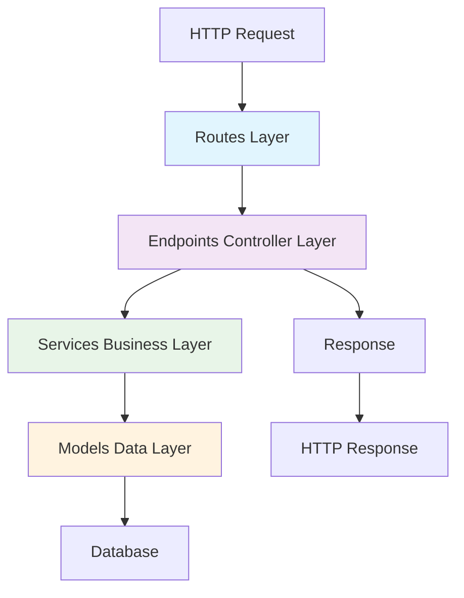

# Part 2: Creating Applications and Hello World

In the previous section, we successfully created and started an Unfazed project. Now we will dive deep into Unfazed's application (App) system, create our first application, and implement the classic "Hello, World" API.

## Unfazed Application System Overview

### What is an Application (App)?

In Unfazed, an **Application (App)** is the basic unit for organizing business logic. Each application is an independent module containing:

- **Data Models** (Models) - Business data structures
- **View Functions** (Endpoints) - API interface processing logic  
- **Route Configuration** (Routes) - URL path mapping
- **Business Services** (Services) - Core business logic
- **Serializers** (Serializers) - Data transformation and validation
- **Test Cases** (Tests) - Quality assurance

This modular design allows you to:
- 🔧 **Decouple business logic**: Each application focuses on specific functional domains
- 🔄 **Code reuse**: Applications can be reused across different projects
- 👥 **Team collaboration**: Different teams can develop different applications in parallel
- 📈 **Easy to extend**: New features can be quickly added through new applications

## Creating the enroll Application

We will create an application named `enroll` to implement the student course enrollment system.

### Using CLI to Create Application

```bash
# Make sure you're in the project's backend directory
cd tutorial/src/backend

# Create enroll application (using simple template)
unfazed-cli startapp -n enroll -t simple
```

> 💡 **Template Description**:
> - `simple`: Basic template, includes core files
> - `standard`: Standard template, includes more feature files

### Application Directory Structure

After creation, you will see the following structure:

```
enroll/
├── admin.py         # Admin management interface configuration
├── app.py           # Application configuration entry
├── endpoints.py     # API view function definitions
├── models.py        # Data model definitions (Tortoise ORM)
├── routes.py        # Route configuration
├── schema.py        # Request/response data models
├── serializers.py   # Data serializers
├── services.py      # Business logic services
├── settings.py      # Application-level configuration
└── test_all.py      # Test cases (pytest)
```

### Application Files Explained

| File             | Functionality                                                                                | Corresponding Features Documentation           |
| ---------------- | -------------------------------------------------------------------------------------------- | ---------------------------------------------- |
| `app.py`         | **Application configuration center**, defines application lifecycle and initialization logic | [app.md](../features/app.md)                   |
| `endpoints.py`   | **API view functions**, handles HTTP requests and responses                                  | [endpoint.md](../features/endpoint.md)         |
| `routes.py`      | **Route configuration**, defines URL to view function mapping                                | [route.md](../features/route.md)               |
| `models.py`      | **Data models**, defines database table structure and relationships                          | [tortoise-orm.md](../features/tortoise-orm.md) |
| `serializers.py` | **Data serialization**, handles data validation and transformation                           | [serializer.md](../features/serializer.md)     |
| `services.py`    | **Business logic**, implements core business functions                                       | -                                              |
| `schema.py`      | **Data structure definitions**, used for OpenAPI documentation generation                    | [openapi.md](../features/openapi.md)           |
| `admin.py`       | **Management interface**, configures backend management functions                            | [admin.md](../features/contrib/admin.md)       |

## Implementing Hello World API

Let's start with the simplest API to gradually understand Unfazed's development process.

### Step 1: Define View Functions

Edit the `enroll/endpoints.py` file:

```python
# tutorial/src/backend/enroll/endpoints.py

from unfazed.http import HttpRequest, PlainTextResponse, JsonResponse

async def hello(request: HttpRequest) -> PlainTextResponse:
    """Simple plain text response"""
    return PlainTextResponse("Hello, World!")

async def hello_json(request: HttpRequest) -> JsonResponse:
    """JSON format response"""
    return JsonResponse({
        "message": "Hello, World!",
        "framework": "Unfazed",
        "version": "1.0.0"
    })
```

**Code Explanation**:
- `HttpRequest`: Unfazed's request object, extended based on Starlette
- `PlainTextResponse`: Plain text response
- `JsonResponse`: JSON response (automatically sets Content-Type)
- `async def`: Unfazed natively supports asynchronous programming

### Step 2: Configure Routes

Edit the `enroll/routes.py` file:

```python
# tutorial/src/backend/enroll/routes.py

import typing as t
from unfazed.route import Route, path
from .endpoints import hello, hello_json

patterns: t.List[Route] = [
    path("/hello", endpoint=hello, methods=["GET"]),
    path("/hello-json", endpoint=hello_json, methods=["GET"]),
]
```

**Route Configuration Description**:
- `path()`: Define a single route
- `endpoint`: Specify the view function to handle this route
- `methods`: Allowed HTTP methods (defaults to ["GET"])

### Step 3: Register Application Routes

Edit the global route configuration `entry/routes.py`:

```python
# tutorial/src/backend/entry/routes.py

from unfazed.route import include, path

patterns = [
    # Include all routes from enroll application
    path("/api/enroll", routes=include("enroll.routes")),
]
```

**Route Organization**:
- `include()`: Include sub-application routes
- Path prefix: All enroll routes will start with `/enroll`

### Step 4: Register Application

Edit project configuration `entry/settings/__init__.py`:

```python
# tutorial/src/backend/entry/settings/__init__.py

# Unfazed project configuration
UNFAZED_SETTINGS = {
    # List of installed applications
    "INSTALLED_APPS": [
        "enroll",  # Register our enroll application
    ],
    
    # Other configuration items...
    "DEBUG": True,
    "PROJECT_NAME": "Tutorial Project",
}
```

**Configuration Description**:
- `INSTALLED_APPS`: Tell Unfazed which applications to load
- Applications will be initialized in the order of the list
- Support inter-application dependency management

## Testing Hello World API

### Start Development Server

```bash
# Start server in backend directory
cd tutorial/src/backend

# Method 1: Using Makefile
make run

# Method 2: Direct use of uvicorn
uvicorn asgi:application --host 127.0.0.1 --port 9527 --reload
```

### Test API Endpoints

Open browser or use curl to test:

**Test plain text API:**
```bash
curl http://127.0.0.1:9527/api/enroll/hello
# Output: Hello, World!
```

**Test JSON API:**
```bash
curl http://127.0.0.1:9527/api/enroll/hello-json
# Output: {"message":"Hello, World!","framework":"Unfazed","version":"1.0.0"}
```

## Understanding Unfazed's Request Service Architecture

Through this simple example, we can see Unfazed's architectural pattern:



### Layer Responsibilities

1. **Routes Layer**: URL path to processing function mapping
2. **Endpoints (Controller Layer)**: Handle HTTP requests, call business logic
3. **Services (Business Layer)**: Implement core business logic
4. **Models (Data Layer)**: Data models and database operations

This layered architecture ensures:
- 📝 **Clear responsibilities**: Each layer focuses on specific functions
- 🔄 **Easy to test**: Each layer can be tested independently
- 🎯 **Easy to maintain**: Modifying one layer doesn't affect other layers
- 📈 **Support for extension**: New features can be added by layers

## Automatic API Documentation

Unfazed has built-in powerful OpenAPI support. After starting the project, you can access:

- **Swagger UI**: `http://127.0.0.1:9527/openapi/docs`
- **ReDoc**: `http://127.0.0.1:9527/openapi/redoc`

These tools will automatically generate API documentation based on your code, no additional configuration needed!

## Next Steps

Congratulations! You have successfully created your first Unfazed application and implemented a Hello World API. In the next tutorial, we will:

- Define data models (Student and Course)
- Use Tortoise ORM for database operations
- Create serializers for data validation

Let's continue to **Part 3: Data Models and Serializers**!

---

## 🎯 Key Points Review

- ✅ Understood the concept and advantages of Unfazed's application system
- ✅ Learned to use CLI tools to create applications
- ✅ Mastered basic route configuration methods
- ✅ Implemented the first API endpoint
- ✅ Understood Unfazed's MVC architecture pattern

## 💡 Best Practice Tips

1. **Application naming**: Use descriptive names like `user_management`, `order_system`
2. **Route organization**: Put related routes in the same application
3. **Code structure**: Keep files with single responsibilities, avoid oversized files
4. **Documentation first**: Utilize OpenAPI automatic documentation feature to ensure API documentation stays in sync
