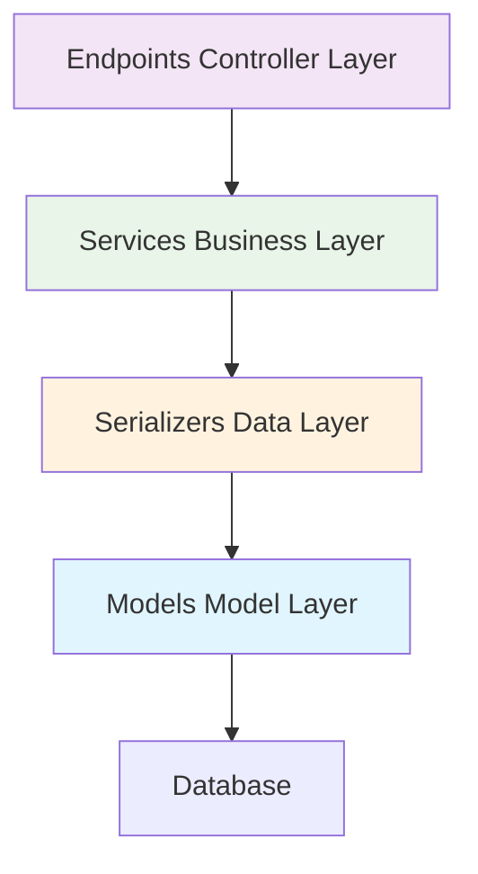

# Part 5: Business Logic Implementation

In the previous section, we defined complete API interfaces and data models. Now we will implement the core business logic, making the APIs actually interact with the database. In Unfazed's architectural design, the Services layer is responsible for encapsulating specific business logic and providing data services for Endpoints.

Through this section, you will master how to use serializers for database operations, handle complex business logic, and implement complete CRUD functionality.

## Services Layer Design Philosophy

### Why Do We Need a Services Layer?

In traditional MVC architecture, business logic is often mixed in controllers, making code difficult to maintain and test. Unfazed adopts a layered architecture, isolating business logic into the Services layer:



**Services Layer Responsibilities**:
- 🎯 **Business Logic Encapsulation**: Implement specific business rules and processes
- 🔄 **Data Processing**: Call serializers for CRUD operations
- 🛡️ **Validation Control**: Business-level data validation and permission checking
- 📊 **Transaction Management**: Handle complex database transactions
- 🔗 **Service Composition**: Combine multiple basic operations to implement complex functions

## Implementing EnrollService

### Creating Service Class

Edit the `enroll/services.py` file:

```python
# src/backend/enroll/services.py

import typing as t
import time
from unfazed.exception import NotFound, ValidationError
from . import models as m
from . import serializers as s

class EnrollService:
    """Student enrollment service class"""
    
    @classmethod
    async def list_student(
        cls,
        page: int = 1,
        size: int = 10,
        search: str = "",
    ) -> t.Dict:
        """
        Get student list
        
        Args:
            page: Page number
            size: Items per page
            search: Search keyword (optional)
            
        Returns:
            Dictionary containing student list and pagination information
        """
        # Build query conditions
        conditions = {}
        if search:
            conditions = {"name__icontains": search}
        
        # Use serializer to query data
        result = await s.StudentSerializer.list_from_ctx(
            conditions, page=page, size=size
        )
        
        # Calculate pagination information
        total_pages = (result.total + size - 1) // size

        return result
    
    @classmethod
    async def list_course(
        cls,
        page: int = 1,
        size: int = 10,
        is_active: bool = True,
    ) -> t.Dict:
        """
        Get course list
        
        Args:
            page: Page number
            size: Items per page
            is_active: Whether to only show active courses
            
        Returns:
            Dictionary containing course list and pagination information
        """
        # Build query conditions
        conditions = {"is_active": is_active} if is_active else {}
        
        # Use serializer to query data
        result = await s.CourseSerializer.list_from_ctx(
            conditions, page=page, size=size
        )
        
        # Calculate pagination information
        total_pages = (result.total + size - 1) // size
        
        return result
    
    @classmethod
    async def get_student(cls, student_id: int) -> t.Dict:
        """
        Get student details
        
        Args:
            student_id: Student ID
            
        Returns:
            Student detailed information
            
        Raises:
            NotFound: Raised when student doesn't exist
        """

        # Use serializer to get single student
        student = await s.StudentWithCoursesSerializer.get_from_ctx(
            student_id, enable_relations=True
        )
        
        return student

    @classmethod
    async def create_student(cls, student_data: t.Dict) -> t.Dict:
        """
        Create student
        
        Args:
            student_data: Student data
            
        Returns:
            Successfully created student information
            
        Raises:
            ValidationError: Raised when data validation fails
        """
        # Check if student ID and email already exist
        existing_student = await m.Student.get_or_none(
            student_id=student_data.get("student_id")
        )
        if existing_student:
            raise ValidationError(f"Student ID {student_data.get('student_id')} already exists")
        
        existing_email = await m.Student.get_or_none(
            email=student_data.get("email")
        )
        if existing_email:
            raise ValidationError(f"Email {student_data.get('email')} is already in use")
        
        # Use serializer to create student
        student = await s.StudentSerializer.create_from_ctx(student_data)
        
        return student
        
    @classmethod
    async def bind(
        cls,
        student_id: int,
        course_id: int,
    ) -> t.Dict:
        """
        Student course binding
        
        Args:
            student_id: Student ID
            course_id: Course ID
            
        Returns:
            Binding result
            
        Raises:
            NotFound: Raised when student or course doesn't exist
            ValidationError: Raised when business validation fails
        """
        # 1. Verify student exists
        student = await m.Student.get_or_none(id=student_id)
        if not student:
            raise NotFound(f"Student {student_id} does not exist")
        
        # 2. Verify course exists
        course = await m.Course.get_or_none(id=course_id)
        if not course:
            raise NotFound(f"Course {course_id} does not exist")
        
        # 3. Check if course is active
        if not course.is_active:
            raise ValidationError(f"Course {course.name} is disabled, cannot enroll")
        
        # 4. Check if already enrolled in this course
        existing_enrollment = await student.courses.filter(id=course_id).exists()
        if existing_enrollment:
            raise ValidationError(f"Student {student.name} is already enrolled in course {course.name}")
        
        # 5. Check if course is full
        enrolled_count = await course.students.all().count()
        if enrolled_count >= course.max_students:
            raise ValidationError(f"Course {course.name} is full, cannot enroll")
        
        # 6. Execute enrollment operation
        await student.courses.add(course)
        
        return student
    
    @classmethod
    async def unbind(
        cls,
        student_id: int,
        course_id: int,
    ) -> t.Dict:
        """
        Student course withdrawal
        
        Args:
            student_id: Student ID
            course_id: Course ID
            
        Returns:
            Withdrawal result
        """
        # Verify student and course
        student = await m.Student.get_or_none(id=student_id)
        if not student:
            raise NotFound(f"Student {student_id} does not exist")
        
        course = await m.Course.get_or_none(id=course_id)
        if not course:
            raise NotFound(f"Course {course_id} does not exist")
        
        # Check if enrolled in this course
        existing_enrollment = await student.courses.filter(id=course_id).exists()
        if not existing_enrollment:
            raise ValidationError(f"Student {student.name} is not enrolled in course {course.name}")
        
        # Execute withdrawal operation
        await student.courses.remove(course)
        
        return student
```

## Updating Endpoints

Now we need to update endpoints to call business logic in services:

```python
# src/backend/enroll/endpoints.py

import typing as t
from unfazed.http import HttpRequest, JsonResponse, PlainTextResponse
from unfazed.route import params as p
from . import schema as s
from . import services as svc

# Keep hello function
async def hello(request: HttpRequest) -> PlainTextResponse:
    """Hello World interface"""
    return PlainTextResponse("Hello, World!")

async def list_student(
    request: HttpRequest,
    page: t.Annotated[int, p.Query(default=1, description="Page number", ge=1)],
    size: t.Annotated[int, p.Query(default=10, description="Items per page", ge=1, le=100)],
    search: t.Annotated[str, p.Query(default="", description="Search keyword")] = "",
) -> t.Annotated[JsonResponse, p.ResponseSpec(model=s.StudentListResponse)]:
    """
    Get student list
    
    Supports searching by name, email, student ID
    """
    result = await svc.EnrollService.list_student(page, size, search)
    return JsonResponse(result)

async def list_course(
    request: HttpRequest,
    page: t.Annotated[int, p.Query(default=1, description="Page number", ge=1)],
    size: t.Annotated[int, p.Query(default=10, description="Items per page", ge=1, le=100)],
    is_active: t.Annotated[bool, p.Query(default=True, description="Show only active courses")] = True,
) -> t.Annotated[JsonResponse, p.ResponseSpec(model=s.CourseListResponse)]:
    """
    Get course list
    
    Can choose whether to show only active courses
    """
    result = await svc.EnrollService.list_course(page, size, is_active)
    return JsonResponse(result)

async def get_student(
    request: HttpRequest,
    student_id: t.Annotated[int, p.Path(description="Student ID")],
) -> t.Annotated[JsonResponse, p.ResponseSpec(model=s.StudentDetailResponse)]:
    """Get student details, including enrollment information"""
    result = await svc.EnrollService.get_student(student_id)
    return JsonResponse(result)

async def create_student(
    request: HttpRequest,
    student_data: t.Annotated[s.CreateStudentRequest, p.Json()],
) -> t.Annotated[JsonResponse, p.ResponseSpec(model=s.StudentDetailResponse)]:
    """Create new student"""
    result = await svc.EnrollService.create_student(student_data.model_dump())
    return JsonResponse(result)

async def bind(
    request: HttpRequest,
    ctx: t.Annotated[s.BindRequest, p.Json()],
) -> t.Annotated[JsonResponse, p.ResponseSpec(model=s.BindResponse)]:
    """Student course binding"""
    result = await svc.EnrollService.bind(ctx.student_id, ctx.course_id)
    return JsonResponse(result)

async def unbind(
    request: HttpRequest,
    ctx: t.Annotated[s.BindRequest, p.Json()],
) -> t.Annotated[JsonResponse, p.ResponseSpec(model=s.BindResponse)]:
    """Student course withdrawal"""
    result = await svc.EnrollService.unbind(ctx.student_id, ctx.course_id)
    return JsonResponse(result)

```

## Completing Schema Definition

To support new functionality, we need to add some new Schema:

```python
# src/backend/enroll/schema.py (add to existing file)

class CreateStudentRequest(BaseModel):
    """Create student request"""
    name: str = Field(description="Student name", min_length=1, max_length=100)
    email: str = Field(description="Email address")
    age: int = Field(description="Age", ge=16, le=100)
    student_id: str = Field(description="Student ID", min_length=1, max_length=20)

class StatsResponse(BaseResponse):
    """Statistics information response"""
    data: t.Dict = Field(description="Statistics data")
```

## Updating Route Configuration

Add new routes to `enroll/routes.py`:

```python
# src/backend/enroll/routes.py

import typing as t
from unfazed.route import Route, path
from .endpoints import (
    hello, list_student, list_course, get_student, create_student,
    bind, unbind, enrollment_stats
)

patterns: t.List[Route] = [
    # Hello World
    path("/hello", endpoint=hello, methods=["GET"], name="hello"),
    
    # Student management
    path("/student-list", endpoint=list_student, methods=["GET"], name="list_students"),
    path("/student-create", endpoint=create_student, methods=["POST"], name="create_student"),

    # Course management
    path("/course-list", endpoint=list_course, methods=["GET"], name="list_courses"),
    
    # Enrollment management
    path("/bind", endpoint=bind, methods=["POST"], name="bind_course"),
    path("/unbind", endpoint=unbind, methods=["POST"], name="unbind_course"),
    
]
```

## Next Steps

Excellent! You have successfully implemented complete business logic and database operations. In the next tutorial, we will:

- Write comprehensive test cases
- Learn to use Unfazed's testing framework
- Implement unit tests and integration tests
- Ensure code quality and reliability

Let's continue to **Part 6: Testing and Quality Assurance**!

---
