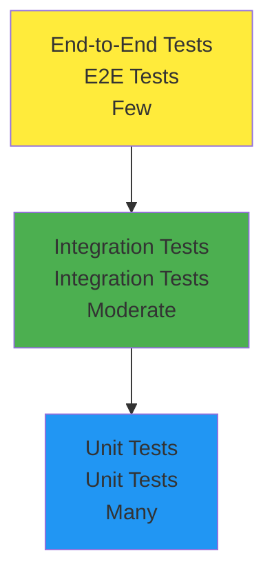

# Part 6: Testing and Quality Assurance

In the previous chapters, we built a complete student course enrollment system. Now we will learn how to write comprehensive test cases for applications to ensure code quality and reliability. Unfazed has built-in powerful testing support, making testing simple and efficient.

Testing is an important part of modern software development that helps us identify problems early, improve code quality, and enhance development confidence.

## Testing Strategy Overview

### Unfazed Testing Philosophy

Unfazed places great emphasis on code robustness, making "easy testing" one of the core principles of framework design. The framework provides:

- 🧪 **Built-in Testing Tools**: `Requestfactory` for API testing
- 🎯 **Layered Testing**: Support for unit testing, integration testing, end-to-end testing
- 📊 **Coverage Support**: Seamless integration with pytest-cov
- 🔄 **Async Testing**: Native support for async test cases
- 🛠️ **Test Fixtures**: Rich Fixture support

### Test Pyramid

We adopt the standard test pyramid strategy:



**Test Layer Descriptions**:
1. **Unit Tests**: Test individual functions/methods functionality
2. **Integration Tests**: Test collaboration between modules
3. **End-to-End Tests**: Test complete user scenarios

### Recommended Testing Scope

Based on Unfazed's architectural design, we strongly recommend testing the following:

1. **Services Layer Testing** - Business logic core
2. **Endpoints Layer Testing** - API interface functionality
3. **Models Layer Testing** - Data model validation
4. **Serializers Layer Testing** - Data transformation functionality

## Test Environment Configuration

### Installing Test Dependencies

First ensure necessary test packages are installed:

```bash
# If using uv
uv add pytest pytest-asyncio pytest-cov

# If using pip
pip install pytest pytest-asyncio pytest-cov
```

### Creating Test Configuration

Create `pytest.ini` configuration file:

```ini
# src/backend/pytest.ini

[tool:pytest]
testpaths = .
python_files = test_*.py *_test.py
python_classes = Test*
python_functions = test_*
asyncio_mode = auto
addopts = 
    --cov=.
    --cov-report=html
    --cov-report=term-missing
    --cov-exclude=*/migrations/*
    --cov-exclude=*/tests/*
    --cov-exclude=*/test_*
filterwarnings =
    ignore::DeprecationWarning
    ignore::PendingDeprecationWarning
```

## Writing Test Cases

### Creating Test Infrastructure

Edit the `enroll/test_all.py` file:

```python
# src/backend/enroll/test_all.py

import typing as t
import pytest
from unfazed.core import Unfazed
from unfazed.test import Requestfactory
from unfazed.exception import NotFound, ValidationError

from enroll import models as m
from enroll import services as svc
from enroll import serializers as s

@pytest.fixture(autouse=True)
async def setup_enroll() -> t.AsyncGenerator[None, None]:
    """
    Test environment setup fixture
    
    Automatically executed before each test, creates clean test environment
    """
    # Clean data
    await m.Student.all().delete()
    await m.Course.all().delete()

    # Create test students
    students_data = [
        {"name": "Alice", "email": "alice@example.com", "age": 20, "student_id": "2024001"},
        {"name": "Bob", "email": "bob@example.com", "age": 19, "student_id": "2024002"},
        {"name": "Charlie", "email": "charlie@example.com", "age": 21, "student_id": "2024003"},
        {"name": "David", "email": "david@example.com", "age": 20, "student_id": "2024004"},
        {"name": "Eve", "email": "eve@example.com", "age": 22, "student_id": "2024005"},
        {"name": "Frank", "email": "frank@example.com", "age": 19, "student_id": "2024006"},
        {"name": "Grace", "email": "grace@example.com", "age": 20, "student_id": "2024007"},
        {"name": "Helen", "email": "helen@example.com", "age": 21, "student_id": "2024008"},
        {"name": "Ivy", "email": "ivy@example.com", "age": 20, "student_id": "2024009"},
        {"name": "Jack", "email": "jack@example.com", "age": 23, "student_id": "2024010"},
        {"name": "Kevin", "email": "kevin@example.com", "age": 19, "student_id": "2024011"},
    ]
    
    for student_data in students_data:
        await s.StudentSerializer.create_from_ctx(student_data)

    # Create test courses
    courses_data = [
        {
            "name": "Math", 
            "code": "MATH101",
            "description": "Basic Mathematics",
            "credits": 3,
            "max_students": 5
        },
        {
            "name": "Physics", 
            "code": "PHYS101",
            "description": "Introduction to Physics",
            "credits": 4,
            "max_students": 3
        },
        {
            "name": "Chemistry", 
            "code": "CHEM101",
            "description": "General Chemistry",
            "credits": 3,
            "max_students": 4
        },
    ]
    
    for course_data in courses_data:
        await s.CourseSerializer.create_from_ctx(course_data)

    yield

    # Clean up after test
    await m.Student.all().delete()
    await m.Course.all().delete()

# ============ Services Layer Testing ============

class TestEnrollServices:
    """EnrollService business logic testing"""

    async def test_list_student(self):
        """Test student list functionality"""
        # Test normal pagination
        result = await svc.EnrollService.list_student(page=1, size=10)
        assert result["success"] is True
        assert len(result["data"]) == 10
        assert result["meta"]["total"] == 11
        assert result["meta"]["total_pages"] == 2

        # Test second page
        result = await svc.EnrollService.list_student(page=2, size=10)
        assert len(result["data"]) == 1

        # Test search functionality
        result = await svc.EnrollService.list_student(page=1, size=10, search="Alice")
        assert len(result["data"]) == 1
        assert result["data"][0]["name"] == "Alice"

        # Test email search
        result = await svc.EnrollService.list_student(page=1, size=10, search="bob@")
        assert len(result["data"]) == 1
        assert result["data"][0]["email"] == "bob@example.com"

    async def test_list_course(self):
        """Test course list functionality"""
        # Test active course list
        result = await svc.EnrollService.list_course(page=1, size=10, is_active=True)
        assert result["success"] is True
        assert len(result["data"]) == 3

        # Test pagination
        result = await svc.EnrollService.list_course(page=2, size=10)
        assert len(result["data"]) == 0

    async def test_get_student(self):
        """Test get student details"""
        student = await m.Student.get(name="Alice")
        
        # Test normal retrieval
        result = await svc.EnrollService.get_student(student.id)
        assert result["success"] is True
        assert result["data"]["name"] == "Alice"

        # Test non-existent student
        with pytest.raises(NotFound):
            await svc.EnrollService.get_student(99999)

    async def test_create_student(self):
        """Test create student"""
        student_data = {
            "name": "New Student",
            "email": "new@example.com", 
            "age": 20,
            "student_id": "2024099"
        }
        
        # Test normal creation
        result = await svc.EnrollService.create_student(student_data)
        assert result["success"] is True
        assert result["data"]["name"] == "New Student"

        # Test duplicate student ID
        with pytest.raises(ValidationError, match="Student ID.*already exists"):
            await svc.EnrollService.create_student(student_data)

        # Test duplicate email
        student_data2 = {
            "name": "Another Student",
            "email": "alice@example.com",  # Use existing email
            "age": 21,
            "student_id": "2024100"
        }
        with pytest.raises(ValidationError, match="Email.*is already in use"):
            await svc.EnrollService.create_student(student_data2)

    async def test_bind_course(self):
        """Test course binding functionality"""
        student = await m.Student.get(name="Alice")
        course = await m.Course.get(name="Math")

        # Test normal enrollment
        result = await svc.EnrollService.bind(student.id, course.id)
        assert result["success"] is True
        assert "successfully enrolled in course" in result["message"]

        # Verify enrollment relationship
        enrolled_courses = await student.courses.all()
        assert len(enrolled_courses) == 1
        assert enrolled_courses[0].id == course.id

        # Test duplicate enrollment
        with pytest.raises(ValidationError, match="already enrolled in course"):
            await svc.EnrollService.bind(student.id, course.id)

        # Test course full (Math course max 5 people)
        students = await m.Student.all()
        math_course = await m.Course.get(name="Math")
        
        # Let other 4 students enroll to make course full
        for i in range(1, 5):
            await svc.EnrollService.bind(students[i].id, math_course.id)
        
        # 6th student enrollment should fail
        with pytest.raises(ValidationError, match="is full"):
            await svc.EnrollService.bind(students[5].id, math_course.id)

        # Test non-existent student
        with pytest.raises(NotFound, match="Student.*does not exist"):
            await svc.EnrollService.bind(99999, course.id)

        # Test non-existent course
        with pytest.raises(NotFound, match="Course.*does not exist"):
            await svc.EnrollService.bind(student.id, 99999)

    async def test_unbind_course(self):
        """Test course withdrawal functionality"""
        student = await m.Student.get(name="Bob")
        course = await m.Course.get(name="Physics")

        # First enroll
        await svc.EnrollService.bind(student.id, course.id)

        # Test normal withdrawal
        result = await svc.EnrollService.unbind(student.id, course.id)
        assert result["success"] is True
        assert "successfully withdrew from course" in result["message"]

        # Verify withdrawal result
        enrolled_courses = await student.courses.all()
        assert len(enrolled_courses) == 0

        # Test withdrawing from non-enrolled course
        with pytest.raises(ValidationError, match="is not enrolled in course"):
            await svc.EnrollService.unbind(student.id, course.id)

# ============ Endpoints Layer Testing ============

class TestEnrollEndpoints:
    """API endpoint integration testing"""

    async def test_hello_endpoint(self, unfazed: Unfazed):
        """Test Hello World endpoint"""
        async with Requestfactory(unfazed) as rf:
            resp = await rf.get("/enroll/hello")
            assert resp.status_code == 200
            assert resp.text == "Hello, World!"

    async def test_student_list_endpoint(self, unfazed: Unfazed):
        """Test student list endpoint"""
        async with Requestfactory(unfazed) as rf:
            # Test default parameters
            resp = await rf.get("/enroll/students")
            assert resp.status_code == 200
            
            data = resp.json()
            assert data["success"] is True
            assert len(data["data"]) == 10  # Default size=10
            assert data["meta"]["total"] == 11

            # Test pagination parameters
            resp = await rf.get("/enroll/students", params={"page": 2, "size": 5})
            assert resp.status_code == 200
            
            data = resp.json()
            assert len(data["data"]) == 5

            # Test search parameters
            resp = await rf.get("/enroll/students", params={"search": "Alice"})
            assert resp.status_code == 200
            
            data = resp.json()
            assert len(data["data"]) == 1

    async def test_course_list_endpoint(self, unfazed: Unfazed):
        """Test course list endpoint"""
        async with Requestfactory(unfazed) as rf:
            resp = await rf.get("/enroll/courses")
            assert resp.status_code == 200
            
            data = resp.json()
            assert data["success"] is True
            assert len(data["data"]) == 3

    async def test_student_detail_endpoint(self, unfazed: Unfazed):
        """Test student detail endpoint"""
        student = await m.Student.get(name="Alice")
        
        async with Requestfactory(unfazed) as rf:
            # Test normal retrieval
            resp = await rf.get(f"/enroll/students/{student.id}")
            assert resp.status_code == 200
            
            data = resp.json()
            assert data["success"] is True
            assert data["data"]["name"] == "Alice"

            # Test non-existent student
            resp = await rf.get("/enroll/students/99999")
            assert resp.status_code == 404

    async def test_bind_endpoint(self, unfazed: Unfazed):
        """Test course binding endpoint"""
        student = await m.Student.get(name="Charlie")
        course = await m.Course.get(name="Chemistry")

        async with Requestfactory(unfazed) as rf:
            # Test normal enrollment
            resp = await rf.post(
                "/enroll/bind", 
                json={"student_id": student.id, "course_id": course.id}
            )
            assert resp.status_code == 200
            
            data = resp.json()
            assert data["success"] is True

            # Test duplicate enrollment
            resp = await rf.post(
                "/enroll/bind", 
                json={"student_id": student.id, "course_id": course.id}
            )
            assert resp.status_code == 422  # ValidationError

            # Test invalid data
            resp = await rf.post(
                "/enroll/bind", 
                json={"student_id": "invalid", "course_id": course.id}
            )
            assert resp.status_code == 422  # Data type error

    async def test_unbind_endpoint(self, unfazed: Unfazed):
        """Test course withdrawal endpoint"""
        student = await m.Student.get(name="David")
        course = await m.Course.get(name="Math")

        async with Requestfactory(unfazed) as rf:
            # First enroll
            await rf.post(
                "/enroll/bind", 
                json={"student_id": student.id, "course_id": course.id}
            )

            # Test withdrawal
            resp = await rf.post(
                "/enroll/unbind", 
                json={"student_id": student.id, "course_id": course.id}
            )
            assert resp.status_code == 200
            
            data = resp.json()
            assert data["success"] is True


## Running Tests

### Basic Test Commands

```bash
# Run all tests
pytest 

# Run specific file tests
pytest enroll/test_all.py

# Run specific test class
pytest enroll/test_all.py::TestEnrollServices

# Run specific test method
pytest enroll/test_all.py::TestEnrollServices::test_list_student

# Show detailed output
pytest -v

# Show test coverage
pytest --cov=enroll

# Generate HTML coverage report
pytest --cov=enroll --cov-report=html
```

### Using Makefile

If the project has a Makefile, you can use:

```bash
# Run tests
make test

# Run tests and generate coverage report
make test-cov

# Run tests and generate HTML report
make test-html
```

## Test Coverage

### Viewing Coverage Reports

After running tests, you will see similar output:

```
=================== test session starts ===================
collected 15 items

enroll/test_all.py::TestEnrollServices::test_list_student PASSED
enroll/test_all.py::TestEnrollServices::test_bind_course PASSED
enroll/test_all.py::TestEnrollEndpoints::test_hello_endpoint PASSED
...

---------- coverage: platform darwin, python 3.11.0 -----------
Name                    Stmts   Miss  Cover   Missing
-----------------------------------------------------
enroll/__init__.py          0      0   100%
enroll/endpoints.py        45      2    96%   23, 67
enroll/models.py           28      0   100%
enroll/serializers.py      15      0   100%
enroll/services.py         89      3    97%   45, 78, 156
enroll/routes.py           12      0   100%
-----------------------------------------------------
TOTAL                     189      5    97%

=================== 15 passed in 2.34s ===================
```

### Improving Test Coverage

If coverage is not high enough, you can:

1. **View HTML Report**:
   ```bash
   pytest --cov=enroll --cov-report=html
   open htmlcov/index.html
   ```

2. **Analyze Uncovered Code**:
   - Check line numbers in Missing column
   - Write tests for untested code paths

3. **Add Boundary Tests**:
   - Test exception cases
   - Test boundary values
   - Test error handling

## Testing Best Practices

### 1. Test Naming Conventions

```python
# Good test naming
async def test_bind_course_success():
    """Test normal course enrollment process"""
    pass

async def test_bind_course_when_course_full():
    """Test course enrollment behavior when course is full"""
    pass

async def test_bind_course_with_invalid_student():
    """Test course enrollment with invalid student ID"""
    pass
```

### 2. Using Test Fixtures

```python
@pytest.fixture
async def enrolled_student():
    """Create enrolled student"""
    student = await m.Student.create(name="Enrolled", email="enrolled@test.com", age=20, student_id="EN001")
    course = await m.Course.create(name="Test Course", code="TC001", description="Test", credits=3, max_students=10)
    await student.courses.add(course)
    return student, course

async def test_unbind_with_fixture(enrolled_student):
    """Test course withdrawal using fixture"""
    student, course = enrolled_student
    result = await svc.EnrollService.unbind(student.id, course.id)
    assert result["success"] is True
```

### 3. Parameterized Testing

```python
@pytest.mark.parametrize("page,size,expected_count", [
    (1, 5, 5),
    (2, 5, 5), 
    (3, 5, 1),
    (1, 20, 11),
])
async def test_student_pagination(page, size, expected_count):
    """Parameterized test for student pagination"""
    result = await svc.EnrollService.list_student(page, size)
    assert len(result["data"]) == expected_count
```

### 4. Mocking External Dependencies

```python
from unittest.mock import patch

@patch('external_service.send_email')
async def test_enrollment_notification(mock_send_email):
    """Test enrollment notification functionality (mock email sending)"""
    mock_send_email.return_value = True
    
    # Execute enrollment
    result = await svc.EnrollService.bind(1, 1)
    
    # Verify email sending was called
    mock_send_email.assert_called_once()
    assert result["success"] is True
```
