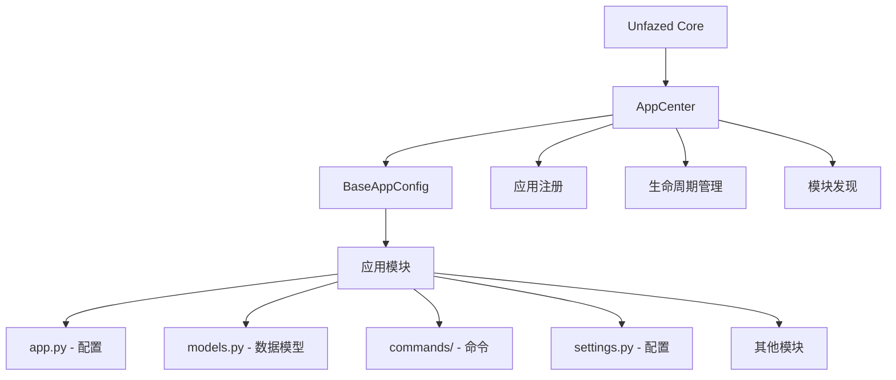
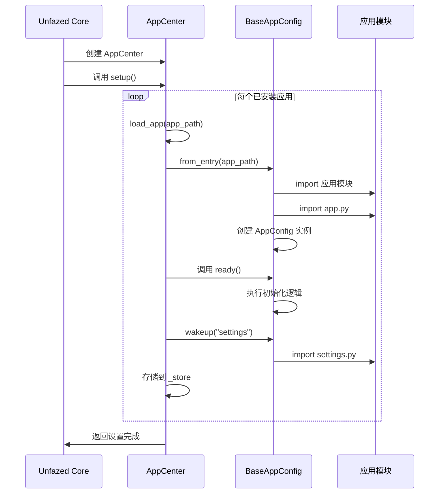

Unfazed APP 应用系统
==================

Unfazed APP 系统是框架的核心组织机制，提供了完整的应用生命周期管理、模块化组织和依赖注入功能。通过 `BaseAppConfig` 和 `AppCenter`，开发者可以创建高度模块化、可重用和可维护的应用程序。

## 系统概述

### 核心特性

- **应用生命周期管理**: 自动化的应用加载、初始化和配置
- **模块化组织**: 基于 Python 模块的应用结构
- **命令发现**: 自动发现和注册应用内的命令
- **延迟加载**: 支持模块的按需加载（wakeup机制）
- **配置管理**: 应用级别的配置和设置管理
- **注册中心**: 统一的应用注册和访问机制

### 系统架构



### 核心组件

- **BaseAppConfig**: 应用配置基类，定义应用的基本行为
- **AppCenter**: 应用注册中心，管理所有已安装的应用
- **应用模块**: 包含业务逻辑的 Python 模块
- **生命周期钩子**: `ready()` 方法用于应用初始化

## 快速开始

### 创建应用

使用 Unfazed CLI 创建新应用：

```bash
# 创建标准应用
unfazed-cli startapp -n myapp

# 创建复杂应用（包含更多文件）
unfazed-cli startapp -n myapp --template complex
```

### 应用目录结构

标准应用结构：

```
myapp/
├── app.py              # 应用配置入口 [必需]
├── models.py           # 数据模型定义
├── endpoints.py        # API 端点定义
├── routes.py           # 路由配置
├── serializers.py      # 数据序列化器
├── services.py         # 业务逻辑服务
├── schema.py           # 数据模型定义
├── settings.py         # 应用级配置 [可选]
├── admin.py            # Admin 管理配置 [可选]
├── commands/           # 自定义命令目录 [可选]
│   ├── __init__.py
│   ├── import_data.py  # 自定义命令文件
│   └── export_data.py
└── tests/              # 测试目录 [可选]
    ├── __init__.py
    ├── test_models.py
    ├── test_endpoints.py
    └── test_services.py
```

### 基本应用配置

```python
# myapp/app.py
from unfazed.app import BaseAppConfig

class AppConfig(BaseAppConfig):
    """应用配置类"""
    
    async def ready(self) -> None:
        """应用就绪时调用的初始化方法"""
        print(f"应用 {self.name} 已就绪")
        
        # 执行应用初始化逻辑
        await self.init_default_data()
        
        # 注册信号处理器
        await self.setup_signal_handlers()
    
    async def init_default_data(self):
        """初始化默认数据"""
        # 应用启动时的数据初始化逻辑
        pass
    
    async def setup_signal_handlers(self):
        """设置信号处理器"""
        # 注册应用级别的信号处理器
        pass
```

### 注册应用

在项目配置中注册应用：

```python
# settings.py
UNFAZED_SETTINGS = {
    "INSTALLED_APPS": [
        "unfazed.contrib.auth",     # Unfazed 内建应用
        "unfazed.contrib.admin",    # Admin 应用
        "myapp",                    # 自定义应用
        "blog",                     # 博客应用
        "user_management",          # 用户管理应用
    ],
    # 其他配置...
}
```


## 应用生命周期

### 应用加载流程



通过 Unfazed APP 系统，开发者可以构建高度模块化、可维护和可扩展的 Web 应用程序，有效管理复杂项目的组织结构和依赖关系。
