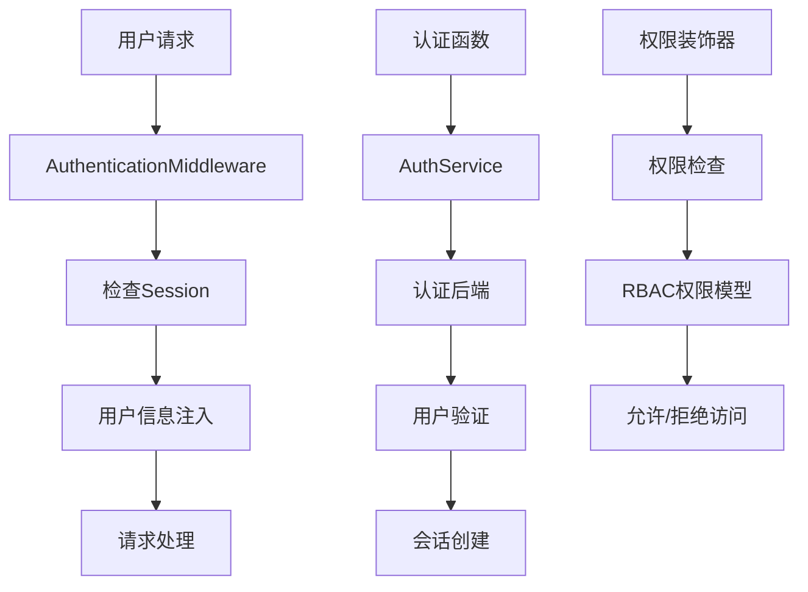

Unfazed Auth 认证系统
====================

Unfazed Auth 是一个功能完整的用户认证和权限管理系统，为 Unfazed 应用提供了用户管理、角色权限控制、多平台登录和会话管理等核心功能。它采用灵活的后端架构设计，支持多种认证方式，包括传统的用户名密码认证和 OAuth 认证。

## 系统概述

### 核心特性

- **用户管理**: 完整的用户注册、登录、登出功能
- **权限系统**: 基于角色(Role)和权限(Permission)的 RBAC 权限模型
- **用户组管理**: 支持用户分组，简化权限分配
- **多后端支持**: 可扩展的认证后端架构，支持多种认证方式
- **会话管理**: 集成 Session 系统，自动处理用户状态
- **装饰器支持**: 提供 `@login_required` 和 `@permission_required` 装饰器
- **中间件集成**: 自动注入用户信息到请求对象
- **OAuth 支持**: 支持第三方 OAuth 登录

### 系统架构



### 核心组件

- **AbstractUser**: 抽象用户模型，支持自定义用户模型
- **Role**: 角色模型，定义用户角色
- **Permission**: 权限模型，定义具体权限
- **Group**: 用户组模型，支持批量权限管理
- **AuthService**: 认证服务，统一管理认证逻辑
- **BaseAuthBackend**: 认证后端基类，支持多种认证方式
- **AuthenticationMiddleware**: 认证中间件，自动处理用户状态

## 快速开始

### 基本配置

```python
# settings.py
UNFAZED_SETTINGS = {
    "INSTALLED_APPS": [
        "unfazed.contrib.session",  # Auth 依赖 Session
        "unfazed.contrib.auth",     # 启用 Auth 系统
        "myapp.users",
    ],
    "MIDDLEWARE": [
        "unfazed.contrib.session.middleware.SessionMiddleware",
        "unfazed.contrib.auth.middleware.AuthenticationMiddleware",
        # 其他中间件...
    ],
    # Auth 系统配置
    "UNFAZED_CONTRIB_AUTH_SETTINGS": {
        "USER_MODEL": "myapp.users.models.User",
        "SESSION_KEY": "unfazed_auth_session",
        "BACKENDS": {
            "default": {
                "BACKEND_CLS": "unfazed.contrib.auth.backends.default.DefaultAuthBackend",
                "OPTIONS": {}
            }
        }
    }
}
```

### 创建用户模型

```python
# myapp/users/models.py
from tortoise import fields
from unfazed.contrib.auth.models import AbstractUser

class User(AbstractUser):
    """自定义用户模型"""
    
    # 继承 AbstractUser 的字段:
    # - account: 用户账号
    # - password: 密码
    # - email: 邮箱
    # - is_superuser: 是否超级用户
    # - groups: 用户组关系
    # - roles: 角色关系
    
    # 添加自定义字段
    first_name = fields.CharField(max_length=50, default="")
    last_name = fields.CharField(max_length=50, default="")
    phone = fields.CharField(max_length=20, default="")
    avatar = fields.CharField(max_length=255, default="")
    is_active = fields.BooleanField(default=True)
    date_joined = fields.DatetimeField(auto_now_add=True)
    last_login = fields.DatetimeField(null=True)
    
    class Meta:
        table = "users"
        
    def __str__(self):
        return self.account
    
    @property
    def full_name(self):
        """获取完整姓名"""
        return f"{self.first_name} {self.last_name}".strip()
    
    @property
    def is_staff(self):
        """是否员工（用于 Admin 系统）"""
        return self.is_superuser
```

### 配置路由

```python
# urls.py
from unfazed.route import path, include

urlpatterns = [
    # Auth API 路由
    path("/api/contrib/auth/", include("unfazed.contrib.auth.routes")),
    # 应用路由
    path("/api/myapp", include("myapp.routes")),
]
```

## 用户认证功能

### 用户注册

```python
# 前端调用示例
POST /api/contrib/auth/register
Content-Type: application/json

{
    "account": "alice",
    "password": "secret123",
    "platform": "default",
    "extra": {
        "email": "alice@example.com",
        "first_name": "Alice",
        "last_name": "Smith"
    }
}

# 响应
{
    "success": true,
    "data": {},
    "message": "注册成功"
}
```

### 用户登录

```python
# 前端调用示例
POST /api/contrib/auth/login
Content-Type: application/json

{
    "account": "alice",
    "password": "secret123",
    "platform": "default",
    "extra": {}
}

# 响应
{
    "success": true,
    "data": {
        "account": "alice",
        "email": "alice@example.com",
        "roles": [
            {"id": 1, "name": "用户"},
            {"id": 2, "name": "编辑"}
        ],
        "groups": [
            {"id": 1, "name": "内容团队"}
        ],
        "extra": {
            "first_name": "Alice",
            "last_name": "Smith"
        }
    },
    "message": "登录成功"
}
```

### 用户登出

```python
# 前端调用示例
POST /api/contrib/auth/logout
Content-Type: application/json

{}

# 响应
{
    "success": true,
    "data": {},
    "message": "登出成功"
}
```

### 在视图中使用用户信息

```python
# myapp/endpoints.py
from unfazed.http import HttpRequest, JsonResponse
from unfazed.contrib.auth.decorators import login_required

@login_required
async def user_profile(request: HttpRequest) -> JsonResponse:
    """获取用户信息 - 需要登录"""
    user = request.user
    
    return JsonResponse({
        "account": user.account,
        "email": user.email,
        "full_name": user.full_name,
        "is_superuser": user.is_superuser,
        "date_joined": user.date_joined.isoformat()
    })

async def public_info(request: HttpRequest) -> JsonResponse:
    """公开信息 - 不需要登录"""
    if request.user:
        message = f"欢迎回来，{request.user.account}!"
    else:
        message = "欢迎访问我们的网站"
    
    return JsonResponse({"message": message})
```

## 权限管理系统

### RBAC 权限模型

Unfazed Auth 采用基于角色的访问控制(RBAC)模型：

```
用户(User) ←→ 角色(Role) ←→ 权限(Permission)
     ↓           ↓
用户组(Group) ←→ 角色(Role)
```

### 创建权限和角色

```python
# 权限管理示例
from unfazed.contrib.auth.models import Role, Permission, Group

async def setup_permissions():
    """设置权限系统"""
    
    # 创建权限
    permissions = [
        ("article.view", "查看文章"),
        ("article.create", "创建文章"),
        ("article.edit", "编辑文章"),
        ("article.delete", "删除文章"),
        ("user.view", "查看用户"),
        ("user.manage", "管理用户"),
        ("system.admin", "系统管理"),
    ]
    
    for access, remark in permissions:
        await Permission.create(access=access, remark=remark)
    
    # 创建角色
    # 1. 读者角色
    reader_role = await Role.create(name="读者")
    await reader_role.permissions.add(
        await Permission.get(access="article.view")
    )
    
    # 2. 编辑角色
    editor_role = await Role.create(name="编辑")
    editor_permissions = await Permission.filter(
        access__in=["article.view", "article.create", "article.edit"]
    )
    await editor_role.permissions.add(*editor_permissions)
    
    # 3. 管理员角色
    admin_role = await Role.create(name="管理员")
    all_permissions = await Permission.all()
    await admin_role.permissions.add(*all_permissions)
    
    # 创建用户组
    content_group = await Group.create(name="内容团队")
    await content_group.roles.add(editor_role)
    
    admin_group = await Group.create(name="管理团队")
    await admin_group.roles.add(admin_role)
    
    return {
        "roles": [reader_role, editor_role, admin_role],
        "groups": [content_group, admin_group]
    }

async def assign_user_permissions():
    """分配用户权限"""
    # 通过角色分配权限
    user = await User.get(account="alice")
    editor_role = await Role.get(name="编辑")
    await user.roles.add(editor_role)
    
    # 通过用户组分配权限
    content_group = await Group.get(name="内容团队")
    await user.groups.add(content_group)
```

### 权限检查

```python
# 使用装饰器进行权限检查
from unfazed.contrib.auth.decorators import permission_required

@permission_required("article.create")
async def create_article(request: HttpRequest) -> JsonResponse:
    """创建文章 - 需要 article.create 权限"""
    user = request.user
    
    # 业务逻辑
    article_data = await request.json()
    # ... 创建文章
    
    return JsonResponse({"message": "文章创建成功"})

@permission_required("user.manage")
async def manage_users(request: HttpRequest) -> JsonResponse:
    """用户管理 - 需要 user.manage 权限"""
    # 管理用户的业务逻辑
    return JsonResponse({"message": "用户管理页面"})

# 手动权限检查
async def check_user_permissions(request: HttpRequest) -> JsonResponse:
    """手动检查权限"""
    user = request.user
    
    if not user:
        return JsonResponse({"error": "未登录"}, status_code=401)
    
    # 检查单个权限
    can_edit = await user.has_permission("article.edit")
    
    # 检查多个权限
    permissions = {
        "can_view": await user.has_permission("article.view"),
        "can_create": await user.has_permission("article.create"),
        "can_edit": await user.has_permission("article.edit"),
        "can_delete": await user.has_permission("article.delete"),
    }
    
    return JsonResponse({
        "user": user.account,
        "permissions": permissions
    })
```

### 查询用户权限信息

```python
async def get_user_auth_info(user_id: int):
    """获取用户完整权限信息"""
    user = await User.get(id=user_id)
    
    # 获取用户角色
    user_roles = await user.query_roles()
    
    # 获取用户组
    user_groups = await user.query_groups()
    
    # 获取所有权限
    all_permissions = set()
    for role in user_roles:
        role_permissions = await role.query_permissions()
        all_permissions.update(perm.access for perm in role_permissions)
    
    return {
        "user": {
            "id": user.id,
            "account": user.account,
            "email": user.email,
            "is_superuser": user.is_superuser
        },
        "roles": [{"id": role.id, "name": role.name} for role in user_roles],
        "groups": [{"id": group.id, "name": group.name} for group in user_groups],
        "permissions": list(all_permissions)
    }
```

## 自定义认证后端

### 创建自定义认证后端

```python
# myapp/auth_backends.py
from unfazed.contrib.auth.backends.base import BaseAuthBackend
from unfazed.contrib.auth.schema import LoginCtx, RegisterCtx
from unfazed.contrib.auth.models import AbstractUser
from unfazed.exception import AccountNotFound, WrongPassword
import bcrypt
import jwt
from datetime import datetime, timedelta

class JWTAuthBackend(BaseAuthBackend):
    """JWT 认证后端"""
    
    @property
    def alias(self) -> str:
        return "jwt"
    
    async def login(self, ctx: LoginCtx):
        """JWT 登录"""
        UserCls = AbstractUser.UserCls()
        
        # 查找用户
        user = await UserCls.get_or_none(account=ctx.account)
        if not user:
            raise AccountNotFound(f"账号 {ctx.account} 不存在")
        
        # 验证密码（使用 bcrypt）
        if not bcrypt.checkpw(ctx.password.encode(), user.password.encode()):
            raise WrongPassword("密码错误")
        
        # 生成会话信息
        session_info = await self.session_info(user, ctx)
        
        # 生成 JWT Token
        token = self.generate_jwt_token(user)
        
        resp = {
            "account": user.account,
            "email": user.email,
            "token": token,
            "expires_in": 3600,  # 1小时
            "roles": [{"id": role.id, "name": role.name} for role in await user.query_roles()],
            "groups": [{"id": group.id, "name": group.name} for group in await user.query_groups()]
        }
        
        return session_info, resp
    
    async def register(self, ctx: RegisterCtx):
        """JWT 注册"""
        UserCls = AbstractUser.UserCls()
        
        # 检查账号是否已存在
        existing_user = await UserCls.get_or_none(account=ctx.account)
        if existing_user:
            raise ValueError(f"账号 {ctx.account} 已存在")
        
        # 加密密码
        hashed_password = bcrypt.hashpw(ctx.password.encode(), bcrypt.gensalt()).decode()
        
        # 创建用户
        user = await UserCls.create(
            account=ctx.account,
            password=hashed_password,
            email=ctx.extra.get("email", ""),
            first_name=ctx.extra.get("first_name", ""),
            last_name=ctx.extra.get("last_name", "")
        )
        
        return {"user_id": user.id, "account": user.account}
    
    async def session_info(self, user: AbstractUser, ctx: LoginCtx):
        """构建会话信息"""
        return {
            "id": user.id,
            "account": user.account,
            "email": user.email,
            "platform": ctx.platform,
            "login_time": datetime.now().isoformat()
        }
    
    async def logout(self, session):
        """JWT 登出（可以实现黑名单机制）"""
        # JWT 通常是无状态的，可以通过黑名单实现登出
        return {"message": "登出成功"}
    
    def generate_jwt_token(self, user: AbstractUser) -> str:
        """生成 JWT Token"""
        payload = {
            "user_id": user.id,
            "account": user.account,
            "exp": datetime.utcnow() + timedelta(hours=1),
            "iat": datetime.utcnow()
        }
        
        secret_key = self.options.get("SECRET_KEY", "your-secret-key")
        return jwt.encode(payload, secret_key, algorithm="HS256")
    
    async def oauth_login_redirect(self) -> str:
        """OAuth 登录重定向（暂不实现）"""
        return ""
    
    async def oauth_logout_redirect(self) -> str:
        """OAuth 登出重定向（暂不实现）"""
        return ""

class LDAPAuthBackend(BaseAuthBackend):
    """LDAP 认证后端示例"""
    
    @property
    def alias(self) -> str:
        return "ldap"
    
    async def login(self, ctx: LoginCtx):
        """LDAP 登录"""
        # LDAP 认证逻辑
        ldap_server = self.options.get("LDAP_SERVER")
        
        # 1. 连接 LDAP 服务器
        # 2. 验证用户凭据
        # 3. 获取用户信息
        # 4. 在本地创建或更新用户
        
        # 示例实现（需要安装 python-ldap）
        UserCls = AbstractUser.UserCls()
        
        # 假设 LDAP 验证成功
        ldap_user_info = await self.authenticate_ldap(ctx.account, ctx.password)
        
        # 在本地创建或更新用户
        user, created = await UserCls.get_or_create(
            account=ctx.account,
            defaults={
                "email": ldap_user_info.get("email", ""),
                "first_name": ldap_user_info.get("given_name", ""),
                "last_name": ldap_user_info.get("surname", "")
            }
        )
        
        if not created:
            # 更新用户信息
            user.email = ldap_user_info.get("email", user.email)
            await user.save()
        
        session_info = await self.session_info(user, ctx)
        resp = {
            "account": user.account,
            "email": user.email,
            "source": "ldap"
        }
        
        return session_info, resp
    
    async def authenticate_ldap(self, username: str, password: str):
        """LDAP 认证实现"""
        # 实际的 LDAP 认证逻辑
        # 这里只是示例
        return {
            "email": f"{username}@company.com",
            "given_name": username.title(),
            "surname": "User"
        }
    
    # ... 其他必需方法的实现
```

### 配置自定义后端

```python
# settings.py
UNFAZED_SETTINGS = {
    "UNFAZED_CONTRIB_AUTH_SETTINGS": {
        "USER_MODEL": "myapp.users.models.User",
        "BACKENDS": {
            "default": {
                "BACKEND_CLS": "unfazed.contrib.auth.backends.default.DefaultAuthBackend",
                "OPTIONS": {}
            },
            "jwt": {
                "BACKEND_CLS": "myapp.auth_backends.JWTAuthBackend",
                "OPTIONS": {
                    "SECRET_KEY": "your-jwt-secret-key"
                }
            },
            "ldap": {
                "BACKEND_CLS": "myapp.auth_backends.LDAPAuthBackend",
                "OPTIONS": {
                    "LDAP_SERVER": "ldap://your-ldap-server.com",
                    "BASE_DN": "dc=company,dc=com"
                }
            }
        }
    }
}

# 使用不同后端登录
# JWT 登录
POST /api/contrib/auth/login
{
    "account": "alice",
    "password": "secret123",
    "platform": "jwt"
}

# LDAP 登录
POST /api/contrib/auth/login
{
    "account": "alice",
    "password": "secret123",
    "platform": "ldap"
}
```

## 中间件和装饰器

### AuthenticationMiddleware

```python
# 中间件自动注入用户信息
class AuthenticationMiddleware:
    """
    认证中间件会自动：
    1. 从 Session 中读取用户信息
    2. 将用户对象注入到 request.user
    3. 如果未登录，request.user 为 None
    """
    
    async def __call__(self, scope, receive, send):
        # 从 session 获取用户信息
        session = scope.get("session")
        if session and "unfazed_auth_session" in session:
            user_data = session["unfazed_auth_session"]
            UserCls = AbstractUser.UserCls()
            user = await UserCls.from_session(user_data)
            scope["user"] = user
        else:
            scope["user"] = None
        
        await self.app(scope, receive, send)
```

### 装饰器使用

```python
from unfazed.contrib.auth.decorators import login_required, permission_required

# 1. 登录检查装饰器
@login_required
async def user_dashboard(request: HttpRequest) -> JsonResponse:
    """用户仪表板 - 需要登录"""
    user = request.user  # 确保 user 不为 None
    
    return JsonResponse({
        "welcome": f"欢迎，{user.account}",
        "dashboard_data": await get_user_dashboard_data(user)
    })

# 2. 权限检查装饰器
@permission_required("article.create")
async def create_article(request: HttpRequest) -> JsonResponse:
    """创建文章 - 需要 article.create 权限"""
    article_data = await request.json()
    
    # 创建文章逻辑
    article = await Article.create(
        title=article_data["title"],
        content=article_data["content"],
        author=request.user
    )
    
    return JsonResponse({"article_id": article.id})

# 3. 组合使用装饰器
@login_required
@permission_required("system.admin")
async def admin_panel(request: HttpRequest) -> JsonResponse:
    """管理面板 - 需要登录且具有管理权限"""
    return JsonResponse({"admin_panel": "welcome to admin"})

# 4. 条件权限检查
async def conditional_access(request: HttpRequest) -> JsonResponse:
    """条件访问控制"""
    user = request.user
    
    if not user:
        return JsonResponse({"error": "需要登录"}, status_code=401)
    
    # 管理员可以查看所有内容
    if user.is_superuser:
        articles = await Article.all()
    # 编辑可以查看已发布的内容
    elif await user.has_permission("article.edit"):
        articles = await Article.filter(status="published")
    # 普通用户只能查看自己的内容
    else:
        articles = await Article.filter(author=user)
    
    return JsonResponse({
        "articles": [{"id": a.id, "title": a.title} for a in articles]
    })
```

## OAuth 认证支持

### OAuth 认证后端

```python
# myapp/oauth_backends.py
import httpx
from unfazed.contrib.auth.backends.base import BaseAuthBackend

class GitHubOAuthBackend(BaseAuthBackend):
    """GitHub OAuth 认证后端"""
    
    @property
    def alias(self) -> str:
        return "github"
    
    async def oauth_login_redirect(self) -> str:
        """生成 GitHub OAuth 登录链接"""
        client_id = self.options["CLIENT_ID"]
        redirect_uri = self.options["REDIRECT_URI"]
        scope = "user:email"
        
        github_auth_url = (
            f"https://github.com/login/oauth/authorize"
            f"?client_id={client_id}"
            f"&redirect_uri={redirect_uri}"
            f"&scope={scope}"
        )
        
        return github_auth_url
    
    async def login(self, ctx: LoginCtx):
        """处理 GitHub OAuth 回调"""
        # ctx.extra 包含 authorization_code
        code = ctx.extra.get("code")
        
        # 1. 使用 code 获取 access_token
        token_data = await self.get_access_token(code)
        access_token = token_data["access_token"]
        
        # 2. 使用 access_token 获取用户信息
        github_user = await self.get_github_user(access_token)
        
        # 3. 在本地创建或更新用户
        UserCls = AbstractUser.UserCls()
        user, created = await UserCls.get_or_create(
            account=github_user["login"],
            defaults={
                "email": github_user.get("email", ""),
                "first_name": github_user.get("name", "").split()[0] if github_user.get("name") else "",
                "avatar": github_user.get("avatar_url", "")
            }
        )
        
        session_info = await self.session_info(user, ctx)
        resp = {
            "account": user.account,
            "email": user.email,
            "avatar": user.avatar,
            "source": "github"
        }
        
        return session_info, resp
    
    async def get_access_token(self, code: str):
        """获取 GitHub Access Token"""
        async with httpx.AsyncClient() as client:
            response = await client.post(
                "https://github.com/login/oauth/access_token",
                data={
                    "client_id": self.options["CLIENT_ID"],
                    "client_secret": self.options["CLIENT_SECRET"],
                    "code": code
                },
                headers={"Accept": "application/json"}
            )
            return response.json()
    
    async def get_github_user(self, access_token: str):
        """获取 GitHub 用户信息"""
        async with httpx.AsyncClient() as client:
            response = await client.get(
                "https://api.github.com/user",
                headers={"Authorization": f"token {access_token}"}
            )
            return response.json()

# OAuth 路由处理
async def github_oauth_callback(request: HttpRequest) -> JsonResponse:
    """GitHub OAuth 回调处理"""
    code = request.query_params.get("code")
    
    if not code:
        return JsonResponse({"error": "缺少授权码"}, status_code=400)
    
    # 使用 GitHub 后端处理登录
    auth_service = AuthService()
    session_info, resp = await auth_service.login(LoginCtx(
        platform="github",
        extra={"code": code}
    ))
    
    # 设置会话
    request.session["unfazed_auth_session"] = session_info
    
    return JsonResponse(resp)
```

### OAuth 配置和使用

```python
# settings.py
UNFAZED_SETTINGS = {
    "UNFAZED_CONTRIB_AUTH_SETTINGS": {
        "BACKENDS": {
            "github": {
                "BACKEND_CLS": "myapp.oauth_backends.GitHubOAuthBackend",
                "OPTIONS": {
                    "CLIENT_ID": "your-github-client-id",
                    "CLIENT_SECRET": "your-github-client-secret",
                    "REDIRECT_URI": "http://localhost:8000/auth/github/callback"
                }
            }
        }
    }
}

# 前端 OAuth 登录流程
# 1. 获取 OAuth 登录链接
GET /api/contrib/auth/oauth-login-redirect?platform=github

# 2. 重定向到 GitHub 进行授权
# 用户在 GitHub 授权后，会重定向到回调地址

# 3. 处理回调（在自定义端点中）
GET /auth/github/callback?code=your-authorization-code
```

## 实际应用示例

### 完整的用户管理系统

```python
# myapp/user_management.py
from unfazed.contrib.auth.models import AbstractUser, Role, Permission, Group
from unfazed.contrib.auth.decorators import login_required, permission_required
from unfazed.http import HttpRequest, JsonResponse

class UserManagementService:
    """用户管理服务"""
    
    @staticmethod
    async def create_user_with_role(account: str, password: str, role_name: str, **extra):
        """创建用户并分配角色"""
        UserCls = AbstractUser.UserCls()
        
        # 创建用户
        user = await UserCls.create(
            account=account,
            password=password,  # 实际应用中需要加密
            **extra
        )
        
        # 分配角色
        if role_name:
            role = await Role.get_or_none(name=role_name)
            if role:
                await user.roles.add(role)
        
        return user
    
    @staticmethod
    async def setup_default_permissions():
        """设置默认权限系统"""
        # 创建基础权限
        permissions_data = [
            ("user.view", "查看用户信息"),
            ("user.create", "创建用户"),
            ("user.edit", "编辑用户"),
            ("user.delete", "删除用户"),
            ("content.view", "查看内容"),
            ("content.create", "创建内容"),
            ("content.edit", "编辑内容"),
            ("content.delete", "删除内容"),
            ("system.admin", "系统管理"),
        ]
        
        for access, remark in permissions_data:
            await Permission.get_or_create(access=access, defaults={"remark": remark})
        
        # 创建角色并分配权限
        # 游客角色
        guest_role, _ = await Role.get_or_create(name="游客")
        guest_perms = await Permission.filter(access__in=["content.view"])
        await guest_role.permissions.add(*guest_perms)
        
        # 用户角色
        user_role, _ = await Role.get_or_create(name="用户")
        user_perms = await Permission.filter(access__in=["user.view", "content.view", "content.create"])
        await user_role.permissions.add(*user_perms)
        
        # 编辑角色
        editor_role, _ = await Role.get_or_create(name="编辑")
        editor_perms = await Permission.filter(access__startswith="content.")
        await editor_role.permissions.add(*editor_perms)
        
        # 管理员角色
        admin_role, _ = await Role.get_or_create(name="管理员")
        all_perms = await Permission.all()
        await admin_role.permissions.add(*all_perms)
        
        return {
            "roles": [guest_role, user_role, editor_role, admin_role],
            "permissions": len(permissions_data)
        }

# API
@permission_required("user.view")
async def list_users(request: HttpRequest) -> JsonResponse:
    """用户列表"""
    UserCls = AbstractUser.UserCls()
    users = await UserCls.all().prefetch_related("roles", "groups")
    
    users_data = []
    for user in users:
        user_roles = await user.query_roles()
        user_groups = await user.query_groups()
        
        users_data.append({
            "id": user.id,
            "account": user.account,
            "email": user.email,
            "is_superuser": user.is_superuser,
            "roles": [{"id": r.id, "name": r.name} for r in user_roles],
            "groups": [{"id": g.id, "name": g.name} for g in user_groups]
        })
    
    return JsonResponse({"users": users_data})

@permission_required("user.create")
async def create_user(request: HttpRequest) -> JsonResponse:
    """创建用户"""
    data = await request.json()
    
    user = await UserManagementService.create_user_with_role(
        account=data["account"],
        password=data["password"],
        role_name=data.get("role"),
        email=data.get("email", ""),
        first_name=data.get("first_name", ""),
        last_name=data.get("last_name", "")
    )
    
    return JsonResponse({
        "message": "用户创建成功",
        "user_id": user.id
    })

@login_required
async def change_password(request: HttpRequest) -> JsonResponse:
    """修改密码"""
    data = await request.json()
    old_password = data["old_password"]
    new_password = data["new_password"]
    
    user = request.user
    
    # 验证旧密码
    if user.password != old_password:  # 实际应用中需要哈希比较
        return JsonResponse({"error": "旧密码错误"}, status_code=400)
    
    # 更新密码
    user.password = new_password  # 实际应用中需要加密
    await user.save()
    
    return JsonResponse({"message": "密码修改成功"})

@permission_required("user.edit")
async def assign_role(request: HttpRequest) -> JsonResponse:
    """分配角色"""
    data = await request.json()
    user_id = data["user_id"]
    role_ids = data["role_ids"]
    
    UserCls = AbstractUser.UserCls()
    user = await UserCls.get(id=user_id)
    
    # 清除现有角色
    await user.roles.clear()
    
    # 分配新角色
    roles = await Role.filter(id__in=role_ids)
    await user.roles.add(*roles)
    
    return JsonResponse({"message": "角色分配成功"})
```

### 权限管理面板

```python
@permission_required("system.admin")
async def permissions_overview(request: HttpRequest) -> JsonResponse:
    """权限总览"""
    # 获取所有权限
    permissions = await Permission.all()
    
    # 获取所有角色及其权限
    roles = await Role.all().prefetch_related("permissions")
    
    # 获取所有用户组及其角色
    groups = await Group.all().prefetch_related("roles")
    
    # 统计信息
    UserCls = AbstractUser.UserCls()
    stats = {
        "total_users": await UserCls.all().count(),
        "total_roles": await Role.all().count(),
        "total_permissions": await Permission.all().count(),
        "total_groups": await Group.all().count()
    }
    
    return JsonResponse({
        "stats": stats,
        "permissions": [{"id": p.id, "access": p.access, "remark": p.remark} for p in permissions],
        "roles": [
            {
                "id": r.id,
                "name": r.name,
                "permissions": [p.access for p in r.permissions]
            }
            for r in roles
        ],
        "groups": [
            {
                "id": g.id,
                "name": g.name,
                "roles": [r.name for r in g.roles]
            }
            for g in groups
        ]
    })
```

## 总结

Unfazed Auth 为现代异步 Web 应用提供了完整的认证和权限管理解决方案：

**核心优势**：
- 🚀 **异步优化**: 基于 asyncio 的高性能认证系统
- 🎯 **灵活架构**: 可扩展的后端系统，支持多种认证方式
- 🔧 **RBAC 模型**: 完整的角色权限管理系统
- 📊 **会话集成**: 与 Session 系统无缝集成
- 🛡️ **安全可靠**: 完整的权限控制和安全机制

**关键特性**：
- 抽象用户模型，支持自定义扩展
- 基于角色和权限的访问控制
- 多认证后端支持（默认、JWT、OAuth、LDAP等）
- 装饰器和中间件的便捷集成
- 完整的用户组和权限管理
- OAuth 第三方登录支持

**技术亮点**：
- 📈 **高性能**: 异步数据库操作和权限检查
- 🎨 **设计优雅**: 清晰的权限模型和认证流程
- 🔄 **灵活扩展**: 支持自定义认证后端和权限策略
- 🏆 **生产就绪**: 完整的企业级认证和授权功能

通过 Unfazed Auth，开发者可以快速构建安全可靠的用户认证系统，支持从简单的用户登录到复杂的企业级权限管理的各种需求。
