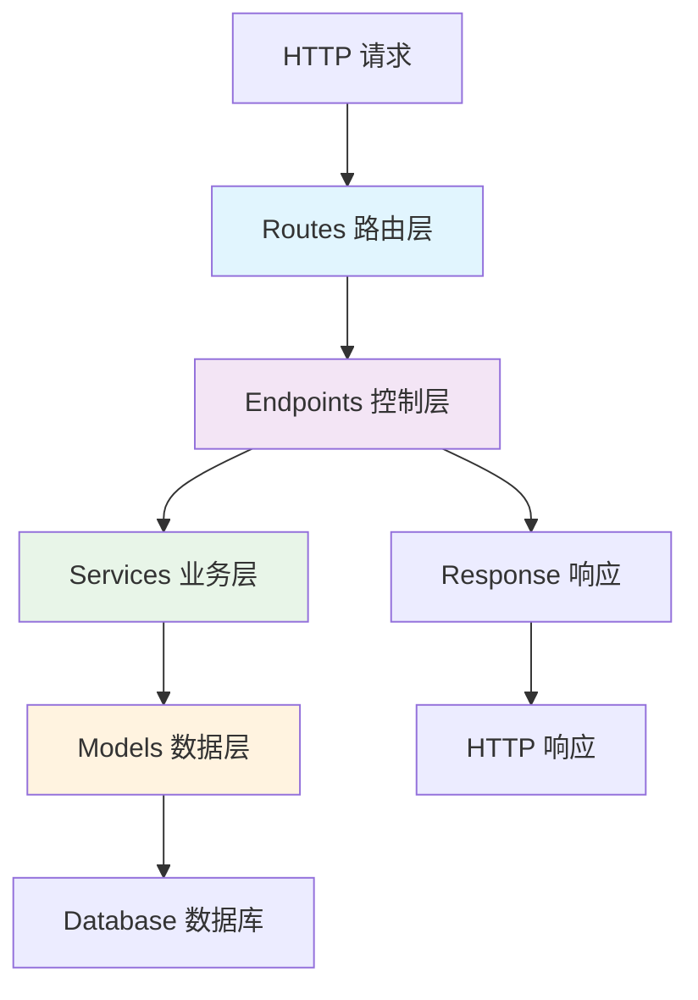

# 第二部分：创建应用与 Hello World

在上一节中，我们成功创建并启动了 Unfazed 项目。现在我们将深入了解 Unfazed 的应用（App）系统，创建我们的第一个应用，并实现经典的 "Hello, World" API。

## Unfazed 应用系统概述

### 什么是应用（App）？

在 Unfazed 中，**应用（App）** 是组织业务逻辑的基本单元。每个应用都是一个独立的模块，包含：

- **数据模型**（Models）- 业务数据结构
- **视图函数**（Endpoints）- API 接口处理逻辑  
- **路由配置**（Routes）- URL 路径映射
- **业务服务**（Services）- 核心业务逻辑
- **序列化器**（Serializers）- 数据转换和验证
- **测试用例**（Tests）- 质量保证

这种模块化设计让你可以：
- 🔧 **解耦业务逻辑**：每个应用专注于特定功能域
- 🔄 **代码重用**：应用可以在不同项目间复用
- 👥 **团队协作**：不同团队可以并行开发不同应用
- 📈 **易于扩展**：新功能可以通过新应用快速添加

## 创建 enroll 应用

我们将创建一个名为 `enroll` 的应用来实现学生选课系统。

### 使用 CLI 创建应用

```bash
# 确保在项目的 backend 目录下
cd tutorial/src/backend

# 创建 enroll 应用（使用简单模板）
unfazed-cli startapp -n enroll -t simple
```

> 💡 **模板说明**：
> - `simple`: 基础模板，包含核心文件
> - `standard`: 标准模板，包含更多功能文件

### 应用目录结构

创建完成后，你会看到以下结构：

```
enroll/
├── admin.py         # Admin 管理界面配置
├── app.py           # 应用配置入口
├── endpoints.py     # API 视图函数定义
├── models.py        # 数据模型定义（Tortoise ORM）
├── routes.py        # 路由配置
├── schema.py        # 请求/响应数据模型
├── serializers.py   # 数据序列化器
├── services.py      # 业务逻辑服务
├── settings.py      # 应用级配置
└── test_all.py      # 测试用例（pytest）
```

### 应用文件详解

| 文件             | 功能说明                                         | 对应 Features 文档                             |
| ---------------- | ------------------------------------------------ | ---------------------------------------------- |
| `app.py`         | **应用配置中心**，定义应用的生命周期和初始化逻辑 | [app.md](../features/app.md)                   |
| `endpoints.py`   | **API 视图函数**，处理 HTTP 请求和响应           | [endpoint.md](../features/endpoint.md)         |
| `routes.py`      | **路由配置**，定义 URL 与视图函数的映射关系      | [route.md](../features/route.md)               |
| `models.py`      | **数据模型**，定义数据库表结构和关系             | [tortoise-orm.md](../features/tortoise-orm.md) |
| `serializers.py` | **数据序列化**，处理数据验证和转换               | [serializer.md](../features/serializer.md)     |
| `services.py`    | **业务逻辑**，实现核心业务功能                   | -                                              |
| `schema.py`      | **数据结构定义**，用于 OpenAPI 文档生成          | [openapi.md](../features/openapi.md)           |
| `admin.py`       | **管理界面**，配置后台管理功能                   | [admin.md](../features/contrib/admin.md)       |

## 实现 Hello World API

让我们从最简单的 API 开始，逐步了解 Unfazed 的开发流程。

### 步骤 1：定义视图函数

编辑 `enroll/endpoints.py` 文件：

```python
# tutorial/src/backend/enroll/endpoints.py

from unfazed.http import HttpRequest, PlainTextResponse, JsonResponse

async def hello(request: HttpRequest) -> PlainTextResponse:
    """简单的纯文本响应"""
    return PlainTextResponse("Hello, World!")

async def hello_json(request: HttpRequest) -> JsonResponse:
    """JSON 格式响应"""
    return JsonResponse({
        "message": "Hello, World!",
        "framework": "Unfazed",
        "version": "1.0.0"
    })
```

**代码解析**：
- `HttpRequest`: Unfazed 的请求对象，基于 Starlette 扩展
- `PlainTextResponse`: 纯文本响应
- `JsonResponse`: JSON 响应（自动设置 Content-Type）
- `async def`: Unfazed 原生支持异步编程

### 步骤 2：配置路由

编辑 `enroll/routes.py` 文件：

```python
# tutorial/src/backend/enroll/routes.py

import typing as t
from unfazed.route import Route, path
from .endpoints import hello, hello_json

patterns: t.List[Route] = [
    path("/hello", endpoint=hello, methods=["GET"]),
    path("/hello-json", endpoint=hello_json, methods=["GET"]),
]
```

**路由配置说明**：
- `path()`: 定义单个路由
- `endpoint`: 指定处理该路由的视图函数
- `methods`: 允许的 HTTP 方法（默认为 ["GET"]）

### 步骤 3：注册应用路由

编辑全局路由配置 `entry/routes.py`：

```python
# tutorial/src/backend/entry/routes.py

from unfazed.route import include, path

patterns = [
    # 包含 enroll 应用的所有路由
    path("/api/enroll", routes=include("enroll.routes")),
]
```

**路由组织**：
- `include()`: 包含子应用的路由
- 路径前缀：所有 enroll 路由都会以 `/enroll` 开头

### 步骤 4：注册应用

编辑项目配置 `entry/settings/__init__.py`：

```python
# tutorial/src/backend/entry/settings/__init__.py

# Unfazed 项目配置
UNFAZED_SETTINGS = {
    # 已安装的应用列表
    "INSTALLED_APPS": [
        "enroll",  # 注册我们的 enroll 应用
    ],
    
    # 其他配置项...
    "DEBUG": True,
    "PROJECT_NAME": "Tutorial Project",
}
```

**配置说明**：
- `INSTALLED_APPS`: 告诉 Unfazed 加载哪些应用
- 应用会按列表顺序进行初始化
- 支持应用间依赖管理

## 测试 Hello World API

### 启动开发服务器

```bash
# 在 backend 目录下启动服务器
cd tutorial/src/backend

# 方式一：使用 Makefile
make run

# 方式二：直接使用 uvicorn
uvicorn asgi:application --host 127.0.0.1 --port 9527 --reload
```

### 测试 API 端点

打开浏览器或使用 curl 测试：

**测试纯文本 API：**
```bash
curl http://127.0.0.1:9527/api/enroll/hello
# 输出: Hello, World!
```

**测试 JSON API：**
```bash
curl http://127.0.0.1:9527/api/enroll/hello-json
# 输出: {"message":"Hello, World!","framework":"Unfazed","version":"1.0.0"}
```

## 理解 Unfazed 的请求服务架构

通过这个简单的例子，我们可以看到 Unfazed 的架构模式：



### 各层职责

1. **Routes（路由层）**：URL 路径与处理函数的映射
2. **Endpoints（控制层）**：处理 HTTP 请求，调用业务逻辑
3. **Services（业务层）**：实现核心业务逻辑
4. **Models（数据层）**：数据模型和数据库操作

这种分层架构确保了：
- 📝 **职责清晰**：每层专注于特定功能
- 🔄 **易于测试**：各层可独立测试
- 🎯 **便于维护**：修改一层不影响其他层
- 📈 **支持扩展**：新功能可按层次添加

## 自动 API 文档

Unfazed 内置了强大的 OpenAPI 支持。启动项目后，你可以访问：

- **Swagger UI**: `http://127.0.0.1:9527/openapi/docs`
- **ReDoc**: `http://127.0.0.1:9527/openapi/redoc`

这些工具会自动根据你的代码生成 API 文档，无需额外配置！

## 下一步

恭喜！你已经成功创建了第一个 Unfazed 应用并实现了 Hello World API。在下一个教程中，我们将：

- 定义数据模型（Student 和 Course）
- 使用 Tortoise ORM 进行数据库操作
- 创建序列化器进行数据验证

让我们继续前往 **第三部分：数据模型与序列化器**！

---

## 🎯 本节要点回顾

- ✅ 理解了 Unfazed 应用系统的概念和优势
- ✅ 学会了使用 CLI 工具创建应用
- ✅ 掌握了基本的路由配置方法
- ✅ 实现了第一个 API 端点
- ✅ 了解了 Unfazed 的 MVC 架构模式

## 💡 最佳实践提示

1. **应用命名**：使用描述性的名称，如 `user_management`、`order_system`
2. **路由组织**：相关的路由放在同一个应用中
3. **代码结构**：保持各文件职责单一，避免过大的文件
4. **文档优先**：利用 OpenAPI 自动文档功能，确保 API 文档同步更新

