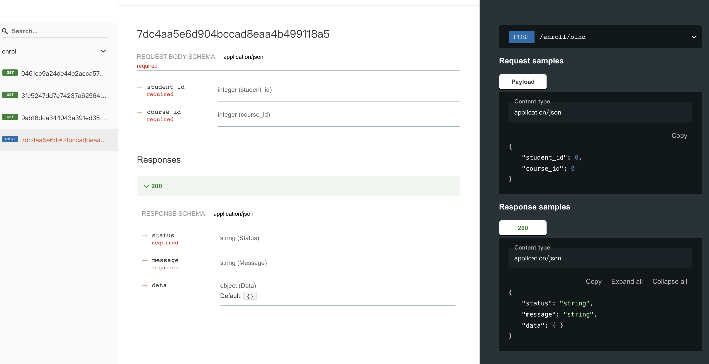

endpoint 函数以及 schema 定义
=====

在上一节定义数据模型以及序列化器之后，本节介绍如何完成endpoint函数定义。


根据`选课`的业务逻辑，我们定义三个接口

- /enroll/student-list：学生列表
- /enroll/course-list：课程列表
- /enroll/bind：学生绑定课程


### /enroll/student-list

接口使用 GET 方法，查询参数为 page 和 size，返回学生列表，包含每位学生的详细信息

首先在 schema 定义返回结构

```python

# src/backend/enroll/schema.py

import typing as t

from pydantic import BaseModel

from .serializers import StudentSerializer


class BaseResponse(BaseModel):
    status: str
    message: str


class StudentListResponse(BaseResponse):
    data: t.List[StudentSerializer]


```

然后在 endpoints.py 中完成对视图函数的请求响应参数定义


```python

# src/backend/enroll/endpoints.py

import typing as t

from unfazed.http import HttpRequest, JsonResponse
from unfazed.route import params as p

from . import schema as s


async def list_student(
    request: HttpRequest,
    page: t.Annotated[int, p.Query(default=1)],
    size: t.Annotated[int, p.Query(default=10)],
) -> t.Annotated[JsonResponse, p.ResponseSpec(model=s.StudentListResponse)]:
    return JsonResponse({})


```

代码解释

- unfazed 使用 Annotated 对请求参数进行注解
- page: t.Annotated[int, p.Query(default=1)], 表示该接口接受一个 querystring 中传递 page 参数，类型为 int 型，非必要参数，默认为 1
- size 同理
- unfazed 同样使用 Annotated 对响应参数进行注解
- t.Annotated[JsonResponse, p.ResponseSpec(s.StudentListResponse)] 表示该接口返回 json 字符串，返回的结构体定义在 StudentListResponse 中


> list_student 实际逻辑留空，放在 service 一节解释


### /enroll/course-list

使用相同方式定义课程列表

`schema.py`

```python

# src/backend/enroll/schema.py
class CourseListResponse(BaseResponse):
    data: t.List[CourseSerializer]

```


`endpoints.py`


```python

async def list_course(
    request: HttpRequest,
    page: t.Annotated[int, p.Query(default=1)],
    size: t.Annotated[int, p.Query(default=10)],
) -> t.Annotated[JsonResponse, p.ResponseSpec(model=s.CourseListResponse)]:
    return JsonResponse({})

```


### /enroll/bind

绑定接口使用 POST 方法，接受 student_id 以及 course_id 两个参数，返回空 json 表示成功


`schema.py`

```python


class BindRequest(BaseModel):
    student_id: int
    course_id: int


class BindResponse(BaseResponse):
    data: t.Dict = {}

```


`endpoints.py`


```python

async def bind(
    request: HttpRequest,
    ctx: t.Annotated[s.BindRequest, p.Json()],
) -> t.Annotated[JsonResponse, p.ResponseSpec(model=s.BindResponse)]:
    return JsonResponse({})

```

解释：

- 相比之前两个接口，unfazed 既可以解析 int/str 等基础数据类型，也可以解析 pydantic model复合类型
- ctx: t.Annotated[s.BindRequest, p.Json()] 表示接口接受请求体组合，请求体包含student_id 以及 course_id 两个参数，使用 ctx 包装


### 注册到 routes

定义完 endpoints 之后，便可以将 endpoints 注册到 routes.py 中


```python

# src/backend/enroll/routes.py
patterns: t.List[Route] = [
    path("/hello", endpoint=hello),
    path("/student-list", endpoint=list_student),
    path("/course-list", endpoint=list_course),
    path("/bind", endpoint=bind, methods=["POST"]),
]


```


### 查看 openapi 文档


unfazed 内置 openapi 支持，注册好路由并启动项目之后，

访问 http://127.0.0.1:9527/openapi/docs#/ 获取 swagger 文档


访问 http://127.0.0.1:9527/openapi/redoc 获取 redoc 文档


