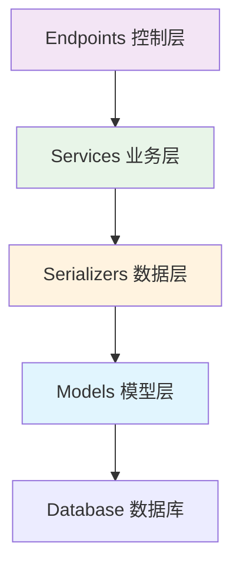

# 第五部分：业务逻辑实现

在上一节中，我们定义了完整的 API 接口和数据模型。现在我们将实现核心的业务逻辑，让 API 真正与数据库交互。在 Unfazed 的架构设计中，Services 层负责封装具体的业务逻辑，为 Endpoints 提供数据服务。

通过本节学习，你将掌握如何使用序列化器进行数据库操作、处理复杂的业务逻辑，以及实现完整的 CRUD 功能。

## Services 层设计理念

### 为什么需要 Services 层？

在传统的 MVC 架构中，业务逻辑经常混杂在控制器（Controller）中，导致代码难以维护和测试。Unfazed 采用分层架构，将业务逻辑独立到 Services 层：



**Services 层的职责**：
- 🎯 **业务逻辑封装**：实现具体的业务规则和流程
- 🔄 **数据处理**：调用序列化器进行 CRUD 操作
- 🛡️ **验证控制**：业务级别的数据验证和权限检查
- 📊 **事务管理**：处理复杂的数据库事务
- 🔗 **服务组合**：组合多个基础操作实现复杂功能

## 实现 EnrollService

### 创建服务类

编辑 `enroll/services.py` 文件：

```python
# src/backend/enroll/services.py

import typing as t
import time
from unfazed.exception import NotFound, ValidationError
from . import models as m
from . import serializers as s

class EnrollService:
    """学生选课服务类"""
    
    @classmethod
    async def list_student(
        cls,
        page: int = 1,
        size: int = 10,
        search: str = "",
    ) -> t.Dict:
        """
        获取学生列表
        
        Args:
            page: 页码
            size: 每页数量
            search: 搜索关键词（可选）
            
        Returns:
            包含学生列表和分页信息的字典
        """
        # 构建查询条件
        conditions = {}
        if search:
            conditions = {"name__icontains": search}
        
        # 使用序列化器查询数据
        result = await s.StudentSerializer.list_from_ctx(
            conditions, page=page, size=size
        )
        
        # 计算分页信息
        total_pages = (result.total + size - 1) // size

        return result
    
    @classmethod
    async def list_course(
        cls,
        page: int = 1,
        size: int = 10,
        is_active: bool = True,
    ) -> t.Dict:
        """
        获取课程列表
        
        Args:
            page: 页码
            size: 每页数量
            is_active: 是否只显示激活的课程
            
        Returns:
            包含课程列表和分页信息的字典
        """
        # 构建查询条件
        conditions = {"is_active": is_active} if is_active else {}
        
        # 使用序列化器查询数据
        result = await s.CourseSerializer.list_from_ctx(
            conditions, page=page, size=size
        )
        
        # 计算分页信息
        total_pages = (result.total + size - 1) // size
        
        return result
    
    @classmethod
    async def get_student(cls, student_id: int) -> t.Dict:
        """
        获取学生详情
        
        Args:
            student_id: 学生ID
            
        Returns:
            学生详细信息
            
        Raises:
            NotFound: 学生不存在时抛出异常
        """

        # 使用序列化器获取单个学生
        student = await s.StudentWithCoursesSerializer.get_from_ctx(
            student_id, enable_relations=True
        )
        
        return student

    @classmethod
    async def create_student(cls, student_data: t.Dict) -> t.Dict:
        """
        创建学生
        
        Args:
            student_data: 学生数据
            
        Returns:
            创建成功的学生信息
            
        Raises:
            ValidationError: 数据验证失败时抛出异常
        """
        # 检查学号和邮箱是否已存在
        existing_student = await m.Student.get_or_none(
            student_id=student_data.get("student_id")
        )
        if existing_student:
            raise ValidationError(f"学号 {student_data.get('student_id')} 已存在")
        
        existing_email = await m.Student.get_or_none(
            email=student_data.get("email")
        )
        if existing_email:
            raise ValidationError(f"邮箱 {student_data.get('email')} 已被使用")
        
        # 使用序列化器创建学生
        student = await s.StudentSerializer.create_from_ctx(student_data)
        
        return student
        
    @classmethod
    async def bind(
        cls,
        student_id: int,
        course_id: int,
    ) -> t.Dict:
        """
        学生选课绑定
        
        Args:
            student_id: 学生ID
            course_id: 课程ID
            
        Returns:
            绑定结果
            
        Raises:
            NotFound: 学生或课程不存在时抛出异常
            ValidationError: 业务验证失败时抛出异常
        """
        # 1. 验证学生是否存在
        student = await m.Student.get_or_none(id=student_id)
        if not student:
            raise NotFound(f"学生 {student_id} 不存在")
        
        # 2. 验证课程是否存在
        course = await m.Course.get_or_none(id=course_id)
        if not course:
            raise NotFound(f"课程 {course_id} 不存在")
        
        # 3. 检查课程是否激活
        if not course.is_active:
            raise ValidationError(f"课程 {course.name} 已停用，无法选课")
        
        # 4. 检查是否已经选过这门课
        existing_enrollment = await student.courses.filter(id=course_id).exists()
        if existing_enrollment:
            raise ValidationError(f"学生 {student.name} 已经选过课程 {course.name}")
        
        # 5. 检查课程是否已满
        enrolled_count = await course.students.all().count()
        if enrolled_count >= course.max_students:
            raise ValidationError(f"课程 {course.name} 已满，无法选课")
        
        # 6. 执行选课操作
        await student.courses.add(course)
        
        return student
    
    @classmethod
    async def unbind(
        cls,
        student_id: int,
        course_id: int,
    ) -> t.Dict:
        """
        学生退课
        
        Args:
            student_id: 学生ID
            course_id: 课程ID
            
        Returns:
            退课结果
        """
        # 验证学生和课程
        student = await m.Student.get_or_none(id=student_id)
        if not student:
            raise NotFound(f"学生 {student_id} 不存在")
        
        course = await m.Course.get_or_none(id=course_id)
        if not course:
            raise NotFound(f"课程 {course_id} 不存在")
        
        # 检查是否已选该课程
        existing_enrollment = await student.courses.filter(id=course_id).exists()
        if not existing_enrollment:
            raise ValidationError(f"学生 {student.name} 未选择课程 {course.name}")
        
        # 执行退课操作
        await student.courses.remove(course)
        
        return student
```

## 更新 Endpoints

现在我们需要更新 endpoints，使其调用 services 中的业务逻辑：

```python
# src/backend/enroll/endpoints.py

import typing as t
from unfazed.http import HttpRequest, JsonResponse, PlainTextResponse
from unfazed.route import params as p
from . import schema as s
from . import services as svc

# 保留 hello 函数
async def hello(request: HttpRequest) -> PlainTextResponse:
    """Hello World 接口"""
    return PlainTextResponse("Hello, World!")

async def list_student(
    request: HttpRequest,
    page: t.Annotated[int, p.Query(default=1, description="页码", ge=1)],
    size: t.Annotated[int, p.Query(default=10, description="每页数量", ge=1, le=100)],
    search: t.Annotated[str, p.Query(default="", description="搜索关键词")] = "",
) -> t.Annotated[JsonResponse, p.ResponseSpec(model=s.StudentListResponse)]:
    """
    获取学生列表
    
    支持按姓名、邮箱、学号进行搜索
    """
    result = await svc.EnrollService.list_student(page, size, search)
    return JsonResponse(result)

async def list_course(
    request: HttpRequest,
    page: t.Annotated[int, p.Query(default=1, description="页码", ge=1)],
    size: t.Annotated[int, p.Query(default=10, description="每页数量", ge=1, le=100)],
    is_active: t.Annotated[bool, p.Query(default=True, description="是否只显示激活课程")] = True,
) -> t.Annotated[JsonResponse, p.ResponseSpec(model=s.CourseListResponse)]:
    """
    获取课程列表
    
    可以选择是否只显示激活的课程
    """
    result = await svc.EnrollService.list_course(page, size, is_active)
    return JsonResponse(result)

async def get_student(
    request: HttpRequest,
    student_id: t.Annotated[int, p.Path(description="学生ID")],
) -> t.Annotated[JsonResponse, p.ResponseSpec(model=s.StudentDetailResponse)]:
    """获取学生详情，包含选课信息"""
    result = await svc.EnrollService.get_student(student_id)
    return JsonResponse(result)

async def create_student(
    request: HttpRequest,
    student_data: t.Annotated[s.CreateStudentRequest, p.Json()],
) -> t.Annotated[JsonResponse, p.ResponseSpec(model=s.StudentDetailResponse)]:
    """创建新学生"""
    result = await svc.EnrollService.create_student(student_data.model_dump())
    return JsonResponse(result)

async def bind(
    request: HttpRequest,
    ctx: t.Annotated[s.BindRequest, p.Json()],
) -> t.Annotated[JsonResponse, p.ResponseSpec(model=s.BindResponse)]:
    """学生选课绑定"""
    result = await svc.EnrollService.bind(ctx.student_id, ctx.course_id)
    return JsonResponse(result)

async def unbind(
    request: HttpRequest,
    ctx: t.Annotated[s.BindRequest, p.Json()],
) -> t.Annotated[JsonResponse, p.ResponseSpec(model=s.BindResponse)]:
    """学生退课"""
    result = await svc.EnrollService.unbind(ctx.student_id, ctx.course_id)
    return JsonResponse(result)

```

## 完善 Schema 定义

为了支持新的功能，我们需要添加一些新的 Schema：

```python
# src/backend/enroll/schema.py (添加到现有文件)

class CreateStudentRequest(BaseModel):
    """创建学生请求"""
    name: str = Field(description="学生姓名", min_length=1, max_length=100)
    email: str = Field(description="邮箱地址")
    age: int = Field(description="年龄", ge=16, le=100)
    student_id: str = Field(description="学号", min_length=1, max_length=20)

class StatsResponse(BaseResponse):
    """统计信息响应"""
    data: t.Dict = Field(description="统计数据")
```

## 更新路由配置

添加新的路由到 `enroll/routes.py`：

```python
# src/backend/enroll/routes.py

import typing as t
from unfazed.route import Route, path
from .endpoints import (
    hello, list_student, list_course, get_student, create_student,
    bind, unbind, enrollment_stats
)

patterns: t.List[Route] = [
    # Hello World
    path("/hello", endpoint=hello, methods=["GET"], name="hello"),
    
    # 学生管理
    path("/student-list", endpoint=list_student, methods=["GET"], name="list_students"),
    path("/student-create", endpoint=create_student, methods=["POST"], name="create_student"),

    # 课程管理
    path("/course-list", endpoint=list_course, methods=["GET"], name="list_courses"),
    
    # 选课管理
    path("/bind", endpoint=bind, methods=["POST"], name="bind_course"),
    path("/unbind", endpoint=unbind, methods=["POST"], name="unbind_course"),
    
]
```

## 下一步

出色！你已经成功实现了完整的业务逻辑和数据库操作。在下一个教程中，我们将：

- 编写全面的测试用例
- 学习使用 Unfazed 的测试框架
- 实现单元测试和集成测试
- 确保代码质量和可靠性

让我们继续前往 **第六部分：测试与质量保证**！

---
