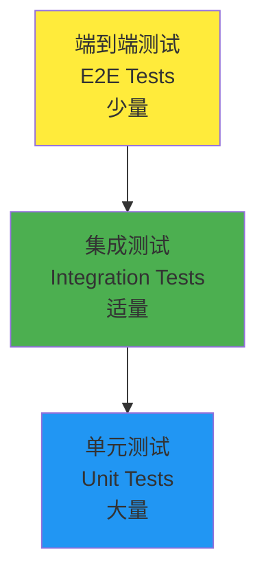

# 第六部分：测试与质量保证

在前面的章节中，我们构建了一个完整的学生选课系统。现在我们将学习如何为应用编写全面的测试用例，确保代码质量和可靠性。Unfazed 内置了强大的测试支持，让测试变得简单而高效。

测试是现代软件开发的重要环节，它能帮助我们及早发现问题、提高代码质量、增强开发信心。

## 测试策略概述

### Unfazed 测试理念

Unfazed 非常注重代码的鲁棒性，将"方便测试"作为框架设计的核心原则之一。框架提供了：

- 🧪 **内置测试工具**: `Requestfactory` 用于 API 测试
- 🎯 **分层测试**: 支持单元测试、集成测试、端到端测试
- 📊 **覆盖率支持**: 与 pytest-cov 无缝集成
- 🔄 **异步测试**: 原生支持异步测试用例
- 🛠️ **测试Fixture**: 丰富的 Fixture 支持

### 测试金字塔

我们采用标准的测试金字塔策略：



**测试层次说明**：
1. **单元测试**: 测试单个函数/方法的功能
2. **集成测试**: 测试模块间的协作
3. **端到端测试**: 测试完整的用户场景

### 推荐测试范围

根据 Unfazed 的架构设计，强烈推荐测试以下内容：

1. **Services 层测试** - 业务逻辑核心
2. **Endpoints 层测试** - API 接口功能
3. **Models 层测试** - 数据模型验证
4. **Serializers 层测试** - 数据转换功能

## 测试环境配置

### 安装测试依赖

首先确保安装了必要的测试包：

```bash
# 如果使用 uv
uv add pytest pytest-asyncio pytest-cov

# 如果使用 pip
pip install pytest pytest-asyncio pytest-cov
```

### 创建测试配置

创建 `pytest.ini` 配置文件：

```ini
# src/backend/pytest.ini

[tool:pytest]
testpaths = .
python_files = test_*.py *_test.py
python_classes = Test*
python_functions = test_*
asyncio_mode = auto
addopts = 
    --cov=.
    --cov-report=html
    --cov-report=term-missing
    --cov-exclude=*/migrations/*
    --cov-exclude=*/tests/*
    --cov-exclude=*/test_*
filterwarnings =
    ignore::DeprecationWarning
    ignore::PendingDeprecationWarning
```

## 编写测试用例

### 创建测试基础设施

编辑 `enroll/test_all.py` 文件：

```python
# src/backend/enroll/test_all.py

import typing as t
import pytest
from unfazed.core import Unfazed
from unfazed.test import Requestfactory
from unfazed.exception import NotFound, ValidationError

from enroll import models as m
from enroll import services as svc
from enroll import serializers as s

@pytest.fixture(autouse=True)
async def setup_enroll() -> t.AsyncGenerator[None, None]:
    """
    测试环境设置夹具
    
    每个测试前自动执行，创建干净的测试环境
    """
    # 清理数据
    await m.Student.all().delete()
    await m.Course.all().delete()

    # 创建测试学生
    students_data = [
        {"name": "Alice", "email": "alice@example.com", "age": 20, "student_id": "2024001"},
        {"name": "Bob", "email": "bob@example.com", "age": 19, "student_id": "2024002"},
        {"name": "Charlie", "email": "charlie@example.com", "age": 21, "student_id": "2024003"},
        {"name": "David", "email": "david@example.com", "age": 20, "student_id": "2024004"},
        {"name": "Eve", "email": "eve@example.com", "age": 22, "student_id": "2024005"},
        {"name": "Frank", "email": "frank@example.com", "age": 19, "student_id": "2024006"},
        {"name": "Grace", "email": "grace@example.com", "age": 20, "student_id": "2024007"},
        {"name": "Helen", "email": "helen@example.com", "age": 21, "student_id": "2024008"},
        {"name": "Ivy", "email": "ivy@example.com", "age": 20, "student_id": "2024009"},
        {"name": "Jack", "email": "jack@example.com", "age": 23, "student_id": "2024010"},
        {"name": "Kevin", "email": "kevin@example.com", "age": 19, "student_id": "2024011"},
    ]
    
    for student_data in students_data:
        await s.StudentSerializer.create_from_ctx(student_data)

    # 创建测试课程
    courses_data = [
        {
            "name": "Math", 
            "code": "MATH101",
            "description": "Basic Mathematics",
            "credits": 3,
            "max_students": 5
        },
        {
            "name": "Physics", 
            "code": "PHYS101",
            "description": "Introduction to Physics",
            "credits": 4,
            "max_students": 3
        },
        {
            "name": "Chemistry", 
            "code": "CHEM101",
            "description": "General Chemistry",
            "credits": 3,
            "max_students": 4
        },
    ]
    
    for course_data in courses_data:
        await s.CourseSerializer.create_from_ctx(course_data)

    yield

    # 测试后清理
    await m.Student.all().delete()
    await m.Course.all().delete()

# ============ Services 层测试 ============

class TestEnrollServices:
    """EnrollService 业务逻辑测试"""

    async def test_list_student(self):
        """测试学生列表功能"""
        # 测试正常分页
        result = await svc.EnrollService.list_student(page=1, size=10)
        assert result["success"] is True
        assert len(result["data"]) == 10
        assert result["meta"]["total"] == 11
        assert result["meta"]["total_pages"] == 2

        # 测试第二页
        result = await svc.EnrollService.list_student(page=2, size=10)
        assert len(result["data"]) == 1

        # 测试搜索功能
        result = await svc.EnrollService.list_student(page=1, size=10, search="Alice")
        assert len(result["data"]) == 1
        assert result["data"][0]["name"] == "Alice"

        # 测试搜索邮箱
        result = await svc.EnrollService.list_student(page=1, size=10, search="bob@")
        assert len(result["data"]) == 1
        assert result["data"][0]["email"] == "bob@example.com"

    async def test_list_course(self):
        """测试课程列表功能"""
        # 测试活跃课程列表
        result = await svc.EnrollService.list_course(page=1, size=10, is_active=True)
        assert result["success"] is True
        assert len(result["data"]) == 3

        # 测试分页
        result = await svc.EnrollService.list_course(page=2, size=10)
        assert len(result["data"]) == 0

    async def test_get_student(self):
        """测试获取学生详情"""
        student = await m.Student.get(name="Alice")
        
        # 测试正常获取
        result = await svc.EnrollService.get_student(student.id)
        assert result["success"] is True
        assert result["data"]["name"] == "Alice"

        # 测试不存在的学生
        with pytest.raises(NotFound):
            await svc.EnrollService.get_student(99999)

    async def test_create_student(self):
        """测试创建学生"""
        student_data = {
            "name": "New Student",
            "email": "new@example.com", 
            "age": 20,
            "student_id": "2024099"
        }
        
        # 测试正常创建
        result = await svc.EnrollService.create_student(student_data)
        assert result["success"] is True
        assert result["data"]["name"] == "New Student"

        # 测试重复学号
        with pytest.raises(ValidationError, match="学号.*已存在"):
            await svc.EnrollService.create_student(student_data)

        # 测试重复邮箱
        student_data2 = {
            "name": "Another Student",
            "email": "alice@example.com",  # 使用已存在的邮箱
            "age": 21,
            "student_id": "2024100"
        }
        with pytest.raises(ValidationError, match="邮箱.*已被使用"):
            await svc.EnrollService.create_student(student_data2)

    async def test_bind_course(self):
        """测试选课绑定功能"""
        student = await m.Student.get(name="Alice")
        course = await m.Course.get(name="Math")

        # 测试正常选课
        result = await svc.EnrollService.bind(student.id, course.id)
        assert result["success"] is True
        assert "成功选择课程" in result["message"]

        # 验证选课关系
        enrolled_courses = await student.courses.all()
        assert len(enrolled_courses) == 1
        assert enrolled_courses[0].id == course.id

        # 测试重复选课
        with pytest.raises(ValidationError, match="已经选过课程"):
            await svc.EnrollService.bind(student.id, course.id)

        # 测试课程满员（Math 课程最多5人）
        students = await m.Student.all()
        math_course = await m.Course.get(name="Math")
        
        # 让其他4个学生选课，使课程满员
        for i in range(1, 5):
            await svc.EnrollService.bind(students[i].id, math_course.id)
        
        # 第6个学生选课应该失败
        with pytest.raises(ValidationError, match="已满"):
            await svc.EnrollService.bind(students[5].id, math_course.id)

        # 测试不存在的学生
        with pytest.raises(NotFound, match="学生.*不存在"):
            await svc.EnrollService.bind(99999, course.id)

        # 测试不存在的课程
        with pytest.raises(NotFound, match="课程.*不存在"):
            await svc.EnrollService.bind(student.id, 99999)

    async def test_unbind_course(self):
        """测试退课功能"""
        student = await m.Student.get(name="Bob")
        course = await m.Course.get(name="Physics")

        # 先选课
        await svc.EnrollService.bind(student.id, course.id)

        # 测试正常退课
        result = await svc.EnrollService.unbind(student.id, course.id)
        assert result["success"] is True
        assert "成功退选课程" in result["message"]

        # 验证退课结果
        enrolled_courses = await student.courses.all()
        assert len(enrolled_courses) == 0

        # 测试退选未选择的课程
        with pytest.raises(ValidationError, match="未选择课程"):
            await svc.EnrollService.unbind(student.id, course.id)

# ============ Endpoints 层测试 ============

class TestEnrollEndpoints:
    """API 端点集成测试"""

    async def test_hello_endpoint(self, unfazed: Unfazed):
        """测试 Hello World 端点"""
        async with Requestfactory(unfazed) as rf:
            resp = await rf.get("/enroll/hello")
            assert resp.status_code == 200
            assert resp.text == "Hello, World!"

    async def test_student_list_endpoint(self, unfazed: Unfazed):
        """测试学生列表端点"""
        async with Requestfactory(unfazed) as rf:
            # 测试默认参数
            resp = await rf.get("/enroll/students")
            assert resp.status_code == 200
            
            data = resp.json()
            assert data["success"] is True
            assert len(data["data"]) == 10  # 默认size=10
            assert data["meta"]["total"] == 11

            # 测试分页参数
            resp = await rf.get("/enroll/students", params={"page": 2, "size": 5})
            assert resp.status_code == 200
            
            data = resp.json()
            assert len(data["data"]) == 5

            # 测试搜索参数
            resp = await rf.get("/enroll/students", params={"search": "Alice"})
            assert resp.status_code == 200
            
            data = resp.json()
            assert len(data["data"]) == 1

    async def test_course_list_endpoint(self, unfazed: Unfazed):
        """测试课程列表端点"""
        async with Requestfactory(unfazed) as rf:
            resp = await rf.get("/enroll/courses")
            assert resp.status_code == 200
            
            data = resp.json()
            assert data["success"] is True
            assert len(data["data"]) == 3

    async def test_student_detail_endpoint(self, unfazed: Unfazed):
        """测试学生详情端点"""
        student = await m.Student.get(name="Alice")
        
        async with Requestfactory(unfazed) as rf:
            # 测试正常获取
            resp = await rf.get(f"/enroll/students/{student.id}")
            assert resp.status_code == 200
            
            data = resp.json()
            assert data["success"] is True
            assert data["data"]["name"] == "Alice"

            # 测试不存在的学生
            resp = await rf.get("/enroll/students/99999")
            assert resp.status_code == 404

    async def test_bind_endpoint(self, unfazed: Unfazed):
        """测试选课绑定端点"""
        student = await m.Student.get(name="Charlie")
        course = await m.Course.get(name="Chemistry")

        async with Requestfactory(unfazed) as rf:
            # 测试正常选课
            resp = await rf.post(
                "/enroll/bind", 
                json={"student_id": student.id, "course_id": course.id}
            )
            assert resp.status_code == 200
            
            data = resp.json()
            assert data["success"] is True

            # 测试重复选课
            resp = await rf.post(
                "/enroll/bind", 
                json={"student_id": student.id, "course_id": course.id}
            )
            assert resp.status_code == 422  # ValidationError

            # 测试无效数据
            resp = await rf.post(
                "/enroll/bind", 
                json={"student_id": "invalid", "course_id": course.id}
            )
            assert resp.status_code == 422  # 数据类型错误

    async def test_unbind_endpoint(self, unfazed: Unfazed):
        """测试退课端点"""
        student = await m.Student.get(name="David")
        course = await m.Course.get(name="Math")

        async with Requestfactory(unfazed) as rf:
            # 先选课
            await rf.post(
                "/enroll/bind", 
                json={"student_id": student.id, "course_id": course.id}
            )

            # 测试退课
            resp = await rf.post(
                "/enroll/unbind", 
                json={"student_id": student.id, "course_id": course.id}
            )
            assert resp.status_code == 200
            
            data = resp.json()
            assert data["success"] is True


## 运行测试

### 基本测试命令

```bash
# 运行所有测试
pytest 

# 运行特定文件的测试
pytest enroll/test_all.py

# 运行特定测试类
pytest enroll/test_all.py::TestEnrollServices

# 运行特定测试方法
pytest enroll/test_all.py::TestEnrollServices::test_list_student

# 显示详细输出
pytest -v

# 显示测试覆盖率
pytest --cov=enroll

# 生成HTML覆盖率报告
pytest --cov=enroll --cov-report=html
```

### 使用 Makefile

如果项目中有 Makefile，可以使用：

```bash
# 运行测试
make test

# 运行测试并生成覆盖率报告
make test-cov

# 运行测试并生成HTML报告
make test-html
```

## 测试覆盖率

### 查看覆盖率报告

运行测试后，你会看到类似的输出：

```
=================== test session starts ===================
collected 15 items

enroll/test_all.py::TestEnrollServices::test_list_student PASSED
enroll/test_all.py::TestEnrollServices::test_bind_course PASSED
enroll/test_all.py::TestEnrollEndpoints::test_hello_endpoint PASSED
...

---------- coverage: platform darwin, python 3.11.0 -----------
Name                    Stmts   Miss  Cover   Missing
-----------------------------------------------------
enroll/__init__.py          0      0   100%
enroll/endpoints.py        45      2    96%   23, 67
enroll/models.py           28      0   100%
enroll/serializers.py      15      0   100%
enroll/services.py         89      3    97%   45, 78, 156
enroll/routes.py           12      0   100%
-----------------------------------------------------
TOTAL                     189      5    97%

=================== 15 passed in 2.34s ===================
```

### 提高测试覆盖率

如果覆盖率不够高，可以：

1. **查看 HTML 报告**：
   ```bash
   pytest --cov=enroll --cov-report=html
   open htmlcov/index.html
   ```

2. **分析未覆盖的代码**：
   - 查看 Missing 列中的行号
   - 为未测试的代码路径编写测试

3. **添加边界测试**：
   - 测试异常情况
   - 测试边界值
   - 测试错误处理

## 测试最佳实践

### 1. 测试命名规范

```python
# 好的测试命名
async def test_bind_course_success():
    """测试正常选课流程"""
    pass

async def test_bind_course_when_course_full():
    """测试课程满员时的选课行为"""
    pass

async def test_bind_course_with_invalid_student():
    """测试使用无效学生ID选课"""
    pass
```

### 2. 使用测试 fixture

```python
@pytest.fixture
async def enrolled_student():
    """创建已选课的学生"""
    student = await m.Student.create(name="Enrolled", email="enrolled@test.com", age=20, student_id="EN001")
    course = await m.Course.create(name="Test Course", code="TC001", description="Test", credits=3, max_students=10)
    await student.courses.add(course)
    return student, course

async def test_unbind_with_fixture(enrolled_student):
    """使用 fixture 测试退课"""
    student, course = enrolled_student
    result = await svc.EnrollService.unbind(student.id, course.id)
    assert result["success"] is True
```

### 3. 参数化测试

```python
@pytest.mark.parametrize("page,size,expected_count", [
    (1, 5, 5),
    (2, 5, 5), 
    (3, 5, 1),
    (1, 20, 11),
])
async def test_student_pagination(page, size, expected_count):
    """参数化测试学生分页"""
    result = await svc.EnrollService.list_student(page, size)
    assert len(result["data"]) == expected_count
```

### 4. 模拟外部依赖

```python
from unittest.mock import patch

@patch('external_service.send_email')
async def test_enrollment_notification(mock_send_email):
    """测试选课通知功能（模拟邮件发送）"""
    mock_send_email.return_value = True
    
    # 执行选课
    result = await svc.EnrollService.bind(1, 1)
    
    # 验证邮件发送被调用
    mock_send_email.assert_called_once()
    assert result["success"] is True
```
