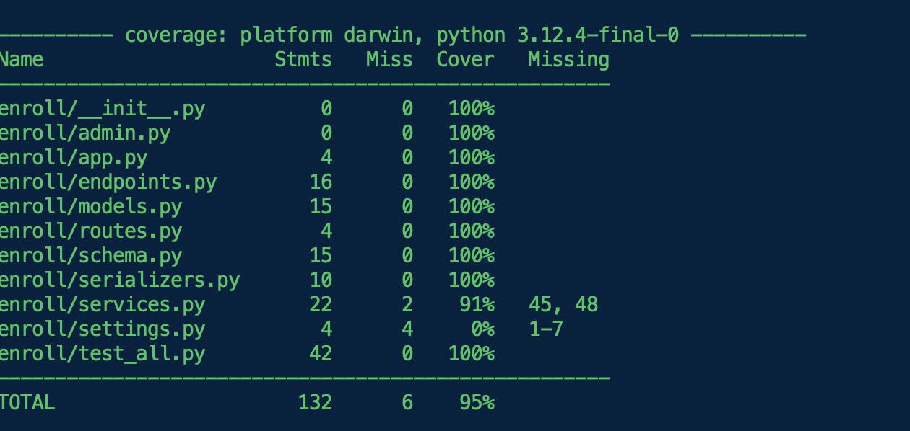

测试
=====

unfazed 非常注重代码的鲁棒性，并且将 `方便测试` 放在很高的等级。unfazed 默认使用 pytest 作为测试组件。


在 unfazed 文件结构设计下，unfazed 强烈推荐开发者至少测试以下两部分内容

1. 测试 services.py 中所有被 endpoints 引用的方法
2. 测试 routes.py 中所有的接口是否能正常访问


第一步的目的是保证业务逻辑能正常进行，第二步是保证接口能正常访问


### 编写测试代码


```python


# src/backend/enroll/test_all.py
import typing as t

import pytest
from unfazed.core import Unfazed
from unfazed.test import Requestfactory

from enroll import models as m
from enroll import services as svc


@pytest.fixture(autouse=True)
async def setup_enroll() -> t.AsyncGenerator[None, None]:
    await m.Student.all().delete()
    await m.Course.all().delete()

    # create more than 10 students
    for student in [
        "Alice",
        "Bob",
        "Charlie",
        "David",
        "Eve",
        "Frank",
        "Grace",
        "Helen",
        "Ivy",
        "Jack",
        "Kevin",
    ]:
        await m.Student.create(name=student, age=20)

    for course in ["Math", "Physics", "Chemistry"]:
        await m.Course.create(name=course, description=f"description of {course}")

    yield

    await m.Student.all().delete()
    await m.Course.all().delete()


async def test_enroll_services() -> None:
    # test list_student
    ret = await svc.EnrollService.list_student(1, 10)
    assert len(ret["data"]) == 10

    ret = await svc.EnrollService.list_student(2, 10)
    assert len(ret["data"]) == 1

    # test list_course
    ret = await svc.EnrollService.list_course(1, 10)

    assert len(ret["data"]) == 3

    ret = await svc.EnrollService.list_course(2, 10)

    assert len(ret["data"]) == 0

    # test bind
    student = await m.Student.get(name="Alice")
    course = await m.Course.get(name="Math")
    ret = await svc.EnrollService.bind(student.id, course.id)
    assert ret["status"] == "ok"


async def test_enroll_endpoints(unfazed: Unfazed) -> None:
    async with Requestfactory(unfazed) as rf:
        # test hello
        resp = await rf.get("/enroll/hello")
        assert resp.status_code == 200

        # test list_student
        resp = await rf.get("/enroll/student-list")
        assert resp.status_code == 200

        # test list_course
        resp = await rf.get("/enroll/course-list")
        assert resp.status_code == 200

        student = await m.Student.get(name="Bob")
        course = await m.Course.get(name="Math")
        resp = await rf.post(
            "/enroll/bind", json={"student_id": student.id, "course_id": course.id}
        )
        assert resp.status_code == 200


```

解释：

- setup_enroll fixture 用于初始化测试环境，创建 11 个学生和 3 门课程
- test_enroll_services 测试 services.py 中的所有方法
- test_enroll_endpoints 测试 routes.py 中的所有接口


### 运行测试

```bash

make test

# or

pytest

```

显示




> 在实际的业务场景中，可能很难达到 100% 的测试覆盖率，但请尽量往这个方向努力。


